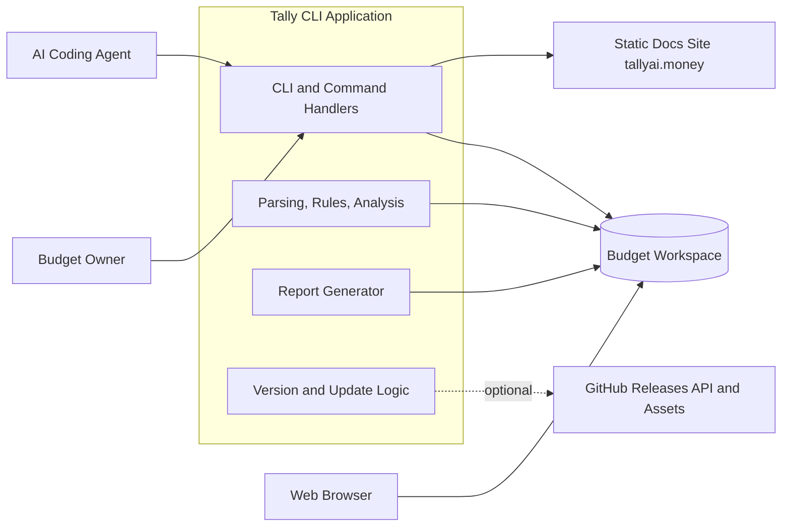
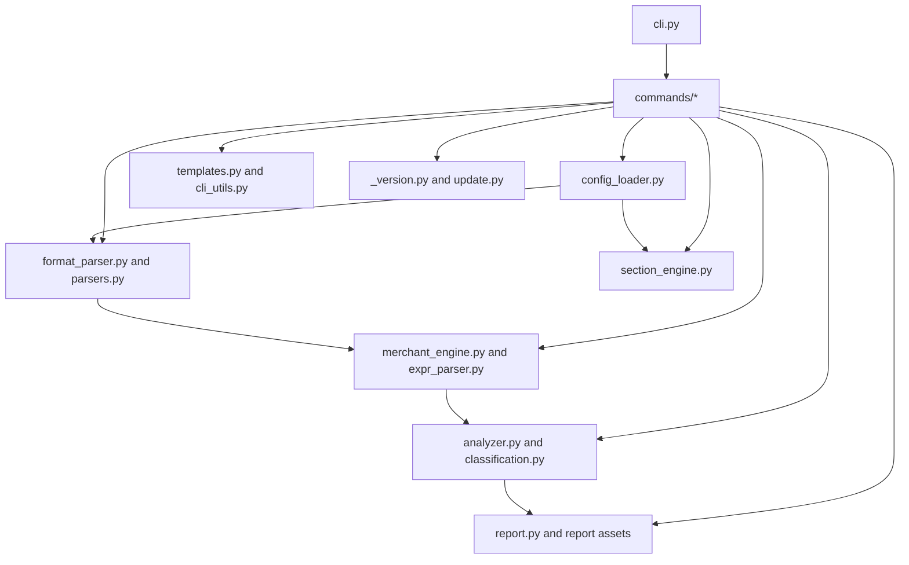
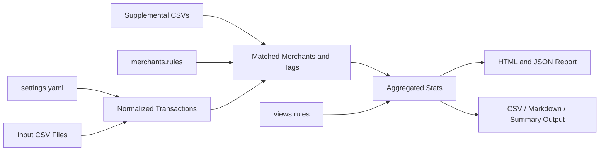
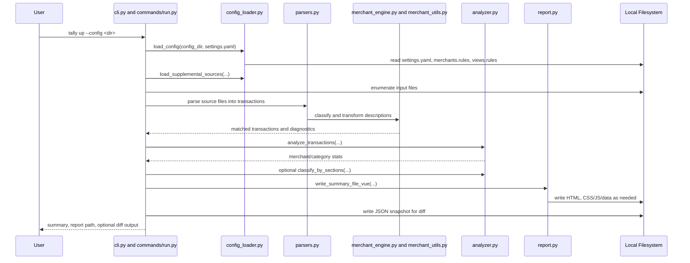
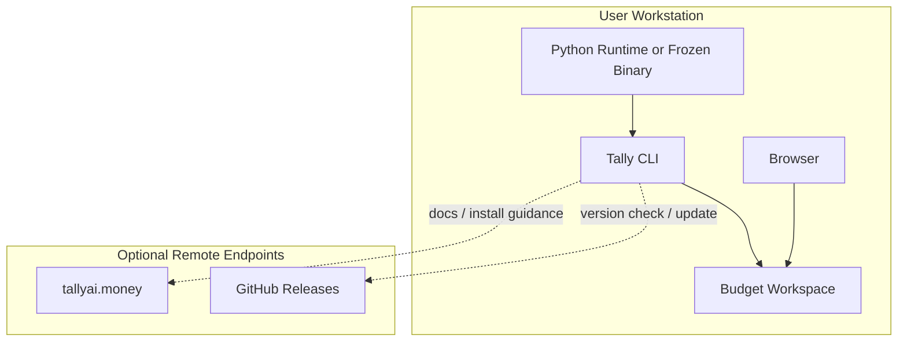

# ISO/IEC/IEEE 42010 Architecture Description

## 1. Identification

**System of interest:** `davidfowl/tally`  
**Repository:** `https://github.com/davidfowl/tally`  
**Architecture description type:** Source-based architecture description aligned to ISO/IEC/IEEE 42010 concepts  
**Inspected branch:** `main`  
**Inspected commit:** `76ebf0102dd235a219da77f9179bd6d0d69ad437`  
**Latest commit at snapshot:** `2026-01-17T09:17:58-08:00` - `Show release notes after tally update`  
**Snapshot date:** `2026-04-06`  
**Primary evidence:** `README.md`, `pyproject.toml`, `src/tally/*`, `docs/*`, and `tests/*` from the repository snapshot above

This document describes the implemented and intended architecture of Tally as observed in the inspected repository snapshot. Where repository metadata, documentation, and code differ, executable code and CLI behavior are treated as the authoritative source of truth.

## 2. Purpose and Scope

The purpose of this architecture description is to make the Tally system understandable to maintainers, contributors, release managers, privacy reviewers, and AI-agent users by documenting:

- the system boundary and external dependencies
- the internal structure and responsibilities
- the primary information objects and their lifecycle
- the main runtime flows for initialization, analysis, explanation, and update
- the installation and operational model
- the architectural rationale, constraints, drift, and risk areas

The scope includes:

- the Python CLI application under `src/tally`
- configuration scaffolding and loading
- CSV parsing, rule evaluation, analysis, and report generation
- the generated local report package and supporting browser assets
- the update/version-checking subsystem
- the static documentation assets in `docs`
- the automated test suite in `tests`

The scope excludes:

- bank or card provider systems that produce the input CSV exports
- external AI assistants themselves
- GitHub Releases and `tallyai.money` implementations beyond their published interfaces
- user-authored budget data outside the repository

## 3. System Mission

Tally is a local-first transaction classification and reporting tool. Its implemented mission is to help a user turn exported financial CSV data into categorized spending insight through a deterministic, text-configured workflow:

1. initialize a budget workspace
2. configure data sources and classification rules
3. parse and normalize transaction files
4. classify transactions and merchants
5. aggregate results into spending views
6. emit local reports and diagnostics

The repository markets the tool as AI-oriented, and the CLI is explicitly shaped to work well with coding agents. Architecturally, however, the system is not an embedded LLM application. The implemented core is a local rule engine plus report generator; AI assistants are external collaborators that operate the CLI and edit rule files.

## 4. Architectural Style and Constraints

The dominant architectural characteristics are:

- local-first batch processing rather than request/response serving
- single-process command-line execution rather than a resident service
- configuration-as-code through YAML and rule files
- interpreted domain-specific languages for merchant and view rules
- static artifact generation for HTML reporting
- optional network usage for release checks and binary updates only

Important constraints visible in the codebase:

- Python `>=3.10` is required
- base runtime dependencies are intentionally minimal; `pyyaml` is the only declared required dependency
- input is file-based CSV data, not API-based banking integration
- output must remain useful to both humans and command-line AI agents
- backward compatibility is preserved for deprecated parser and rules formats

## 5. Stakeholders and Concerns

| Stakeholder | Primary Concerns |
|---|---|
| Budget owner / end user | Local privacy, easy setup, correct categorization, understandable reports, low ceremony |
| AI coding agent user | Stable CLI commands, machine-readable outputs, inspectability, diagnosability, workflow guidance |
| Maintainer / contributor | Clear module boundaries, testability, safe evolution of rule syntax, manageable compatibility burden |
| Release manager | Packaging, version checks, self-update safety, platform asset naming, install flow reliability |
| Privacy / security reviewer | Minimizing cloud exposure, handling of sensitive financial data, local storage behavior, network boundaries |
| Report consumer | Accurate totals, useful visualizations, reproducible output artifacts, browser compatibility |
| Documentation maintainer | Alignment between docs site, CLI behavior, and actual feature set |
| Test maintainer | Coverage of parsing, rule semantics, HTML behavior, CLI regression, cross-platform smoke checks |

## 6. Viewpoint Catalog

| Viewpoint | Stakeholders | Concerns Addressed | Model Kinds |
|---|---|---|---|
| Context viewpoint | End user, AI agent user, privacy reviewer, release manager | System boundary, external actors, trust boundaries, external services | Context diagram, actor/dependency table |
| Module viewpoint | Maintainer, contributor, test maintainer | Decomposition, responsibility assignment, internal dependencies, modifiability | Module table, dependency diagram |
| Information viewpoint | Maintainer, privacy reviewer, report consumer | Data ownership, file formats, lifecycle of configuration and results | Information model table, transformation flow |
| Runtime viewpoint | End user, AI agent user, maintainer | Execution flow, failure handling, command behavior, major processing steps | Sequence flow, command narratives |
| Deployment viewpoint | Release manager, privacy reviewer, end user | Installation modes, runtime nodes, storage locations, operational dependencies | Deployment diagram, node table |
| Quality viewpoint | All major stakeholders | Tradeoffs for usability, privacy, portability, reliability, performance | Quality attribute table, risk mapping |

## 7. Context View

### 7.1 Context Diagram

### 7.2 Context Interpretation

The system boundary is narrow:

- Tally runs on a user's machine as a CLI application.
- Its primary dependencies are local files in a budget workspace.
- The browser is not part of the system; it is an external renderer for generated HTML.
- External AI assistants are outside the system boundary and interact through the CLI and filesystem.
- Network access is optional and peripheral. Core transaction analysis is local. Remote access is used only for documentation, install scripts, version checks, and binary update downloads.

### 7.3 External Dependencies

| External Element | Purpose | Required for Core `tally up` Flow | Notes |
|---|---|---|---|
| Local filesystem | Input CSVs, rules, settings, outputs, optional cache | Yes | Primary persistence boundary |
| Web browser | View generated HTML report | No | External consumer of output artifact |
| GitHub Releases API/assets | Version check and binary self-update | No | Failure is tolerated silently or with user-visible messaging |
| `tallyai.money` static docs | Documentation and install scripts | No | Adjacent product surface, not part of runtime classification pipeline |
| AI coding agents | Assist setup and rule authoring | No | Important stakeholder, not embedded component |

## 8. Module View

### 8.1 Module Decomposition

| Module / Area | Key Files | Responsibilities |
|---|---|---|
| CLI composition | `src/tally/cli.py` | Defines command surface, parses arguments, dispatches subcommands, exposes version/update entry points |
| Command handlers | `src/tally/commands/*.py` | Implements user-visible commands such as `init`, `up`, `discover`, `diag`, `explain`, `workflow`, `reference`, and `update` |
| Workspace scaffolding and utilities | `src/tally/templates.py`, `src/tally/cli_utils.py`, `src/tally/migrations.py`, `src/tally/path_utils.py` | Creates starter budget files, resolves config directories and file patterns, handles migration and compatibility guidance |
| Configuration loading | `src/tally/config_loader.py` | Loads `settings.yaml`, resolves parser formats, identifies merchant/views files, loads supplemental sources, collects warnings |
| Parsing and normalization | `src/tally/format_parser.py`, `src/tally/parsers.py` | Parses format strings and converts CSV rows into normalized transactions, including skipped-row diagnostics |
| Merchant rule engine | `src/tally/merchant_engine.py`, `src/tally/merchant_utils.py`, `src/tally/expr_parser.py` | Parses merchant rules, evaluates expressions safely, applies transforms, computes merchant matches and explanations |
| View/section engine | `src/tally/section_engine.py` | Parses and evaluates `views.rules` against analyzed merchant aggregates |
| Classification and analysis | `src/tally/classification.py`, `src/tally/analyzer.py` | Classifies income/transfer/investment/refund semantics, aggregates totals and merchant statistics, exports multiple formats, computes diffs |
| Reporting | `src/tally/report.py`, `src/tally/spending_report.html`, `src/tally/spending_report.css`, `src/tally/spending_report.js` | Builds HTML report package and supporting JSON/JS data, supports inline or separated assets |
| Distribution and updates | `src/tally/_version.py`, `src/tally/commands/update.py`, `pyproject.toml`, `docs/install*.sh`, `docs/install*.ps1` | Version reporting, release discovery, binary self-update for frozen installs, packaging metadata and install flows |
| Optional cache subsystem | `src/tally/rule_cache.py` | Stores rules and transaction fingerprints in SQLite under `.tally/cache.db`; present in code and tests but not wired into the primary `up` pipeline |
| Test suite | `tests/*` | Validates parser behavior, CLI behavior, rule semantics, report HTML, and smoke flows |

### 8.2 Module Dependency View

### 8.3 Module Interpretation

The architecture is intentionally direct:

- `cli.py` is the composition root.
- command modules orchestrate use cases rather than burying orchestration inside engines.
- parsing, rule evaluation, analysis, and reporting are separated into distinct modules with low-level Python data structures as handoff contracts.
- report generation is downstream from analysis and does not own transaction semantics.
- update/version logic is deliberately isolated from the financial processing path.

## 9. Information View

### 9.1 Core Information Objects

| Information Object | Source / Owner | Persistence | Description |
|---|---|---|---|
| `settings.yaml` | User workspace, loaded by `config_loader.py` | Local file | Declares data sources, output settings, rule mode, and optional views file |
| `merchants.rules` | User workspace, parsed by `merchant_engine.py` | Local file | Merchant classification DSL with matching expressions, categories, subcategories, tags, transforms, and variables |
| `views.rules` | User workspace, parsed by `section_engine.py` | Local file | Aggregation/view DSL that groups merchants into overlapping views |
| Input CSVs | User workspace | Local files | Raw exported transaction data; may be addressed individually, by directory, or by glob |
| Supplemental sources | User workspace + `config_loader.py` | Local files -> in-memory dicts | Query-only CSV sources used by expressions but not emitted as transactions |
| Normalized transactions | `parsers.py`, `merchant_utils.py` | In-memory | Parsed rows with normalized date, description, amount, tags, source, and optional extra fields |
| Merchant match metadata | `merchant_engine.py` | In-memory | Match result details used for explainability and report tooltips |
| Aggregated stats | `analyzer.py` | In-memory, optionally serialized | Merchant/category totals, months active, cash flow, credits, transfer and investment summaries |
| HTML report | `report.py` | Local file | Interactive output for browser consumption |
| JSON report | `analyzer.py` export + `commands/run.py` | Local file | Machine-readable snapshot used for diffs and external inspection |
| CSV / Markdown / Summary output | `analyzer.py` exports | Stdout or file | Alternate representations of analysis results |
| Optional cache database | `rule_cache.py` | Local SQLite file | Cache of parsed rules and transaction metadata under `config/.tally/cache.db` |

### 9.2 Information Transformation Flow

### 9.3 Information Semantics

Architecturally important semantics visible in the code:

- amount sign handling is explicit and configurable through format placeholders such as `{amount}`, `{-amount}`, and `{+amount}`
- transaction tags are not cosmetic; tags such as `income`, `transfer`, `investment`, and `refund` alter analytical treatment
- merchant rules and view rules are separate languages over different abstraction levels:
  - merchant rules operate on transactions and normalized fields
  - view rules operate on merchant-level aggregates
- output JSON is a durable interface used both for machine consumption and previous-report diffs
- generated HTML is assembled from static templates plus embedded or externalized CSS/JS and serialized data

## 10. Runtime View

### 10.1 Primary Runtime Scenario: `tally up`

### 10.2 Secondary Runtime Scenarios

| Command | Runtime Purpose | Architectural Notes |
|---|---|---|
| `tally init` | Creates starter workspace and upgrade paths | Scaffolds `config/settings.yaml`, `config/merchants.rules`, and `config/views.rules`; may migrate legacy CSV rules |
| `tally inspect` | Helps derive format strings from CSV files | Supports safe onboarding into the parsing pipeline |
| `tally discover` | Lists uncategorized merchants with suggested rules | Human/agent-friendly refinement loop over the same classification core |
| `tally explain` | Shows classification reasoning and matching rules | Important explainability surface for debugging DSL behavior |
| `tally diag` | Shows config/rule/source issues | Operational diagnostics surface |
| `tally workflow` | Shows context-aware next steps | Explicitly designed for AI-agent workflows; currently shells out to `tally discover --format json` when it can |
| `tally reference` | Displays rule syntax documentation | Built-in reference surface that reduces context switching to the website |
| `tally update` | Checks releases and performs binary update | Separate operational path; only installs updates when running as a frozen binary |

### 10.3 Runtime Characteristics

- Execution is synchronous and single-process.
- There is no daemon, service host, message broker, or remote database.
- Failure handling is mixed:
  - missing config or malformed settings are fatal
  - per-file parsing errors are often tolerated while other files continue
  - unknown or skipped rows are surfaced through CLI diagnostics
  - update/version network failures degrade gracefully
- The main reporting flow is deterministic for a given input workspace and ruleset.

## 11. Deployment and Operational View

### 11.1 Deployment Diagram

### 11.2 Installation Modes

| Mode | Evidence | Characteristics |
|---|---|---|
| Source / tool install | `pyproject.toml`, CLI entry point `tally = "tally.cli:main"` | Python-managed install, easiest for contributors, cannot self-update through `tally update` |
| Frozen binary | `pyproject.toml` optional `pyinstaller`, `_version.py`, `docs/install*.sh`, `docs/install*.ps1` | Platform-specific binary artifacts, supports self-update against GitHub Releases |
| Static docs site | `docs/*` | Separate static surface for onboarding and reference, not part of transaction execution |

### 11.3 Operational Model

- Primary runtime state lives in the user's budget folder and generated outputs.
- Default output location is the budget parent plus `output/spending_summary.html`, unless overridden.
- HTML generation can embed CSS/JS inline or emit them as separate files.
- JSON snapshots are retained beside the HTML output and used to compute diffs between runs.
- The application communicates primarily through stdout/stderr rather than structured logging infrastructure.
- Privacy posture is favorable for local use because core processing does not require remote services.

## 12. Quality Attribute View

| Quality Attribute | Architectural Support | Tradeoffs / Limits |
|---|---|---|
| Usability | `init`, `workflow`, `inspect`, `discover`, `explain`, `reference`, helpful CLI diagnostics, starter templates | Rich CLI surface increases maintenance burden and compatibility surface |
| Privacy | Local-first files, no mandatory cloud APIs for classification, browser report generated locally | Sensitive financial data is still stored in plain local files and generated reports |
| Modifiability | Clear module split, rule DSLs externalized from code, static report assets separated from analytics, tests across major subsystems | Backward compatibility for legacy formats and hidden coupling through shared dict shapes increase complexity |
| Reliability | Deterministic rule engine, skipped-row diagnostics, regression tests including HTML/report behavior | No strong schema boundary between modules; errors can surface late through dictionary contracts |
| Portability | Python 3.10+, minimal base dependencies, Windows/macOS/Linux release assets | Self-update logic and install paths are platform-conditional and more complex for frozen binaries |
| Performance | Single-process local execution, optional embeddings disabled unless installed, no network in core flow | Large datasets stay in memory; optional cache subsystem is not currently exploited by main flow |
| Explainability | `explain`, `diag`, rule/source metadata in report output, explicit tag semantics | Rule complexity can still become difficult to reason about as user rulesets grow |

## 13. Architecture Decisions and Rationale

| Decision | Status | Rationale | Consequence |
|---|---|---|---|
| Use a local CLI instead of a hosted service | Implemented | Financial data stays local, workflow is scriptable, easy to pair with coding agents | No multi-user collaboration or central sync; user manages files and environment |
| Use explicit rule DSLs instead of opaque model inference in the core pipeline | Implemented | Determinism, reproducibility, explainability, and low runtime dependency footprint | More setup effort; user or agent must author and refine rules |
| Separate merchant classification rules from aggregate view rules | Implemented | Keeps transaction-level logic distinct from reporting/grouping concerns | Users must learn two related but different languages |
| Generate a static HTML report package | Implemented | Easy sharing and inspection, no server required, rich interactive UI in browser | Report UI logic is split across Python and browser JavaScript |
| Preserve legacy parser and rule compatibility | Implemented / transitional | Smooth migration for early adopters | Adds code paths, deprecation handling, and conceptual complexity |
| Make update/version checks optional and failure-tolerant | Implemented | Core finance workflow should not depend on network availability | Version awareness is weaker offline or for source installs |
| Keep semantic embeddings optional | Implemented but weakly packaged | Avoid heavy mandatory ML dependency for all users | Capability is latent and packaging/discoverability are inconsistent because `sentence_transformers` is not declared as an optional extra |

## 14. Correspondence and Consistency Rules

The following rules are used to keep the views in this architecture description consistent:

1. Every CLI command named in the context and runtime views must correspond to an argument parser entry in `src/tally/cli.py` and a concrete handler in `src/tally/commands/*`.
2. Every input data source in the information view must pass through `config_loader.resolve_source_format()` before reaching parsing logic.
3. Every transaction included in analysis must have originated from a configured non-supplemental source and must pass through parsing plus classification before aggregation.
4. Every view/section in the runtime and information views must depend on merchant aggregates, not raw CSV rows directly.
5. External network dependencies may appear in the context and deployment views only if the inspected code references them explicitly; they must remain optional to the core `tally up` flow.
6. Architectural statements about backward compatibility must correspond to concrete migration, deprecation, or legacy parser code paths in the repository.
7. Quality claims should be supported by either explicit code structure or automated tests present in `tests/*`.

## 15. Risks, Gaps, and Architectural Debt

| ID | Risk / Gap | Impact | Evidence / Notes |
|---|---|---|---|
| R1 | Product positioning drift: metadata describes the tool as "LLM-powered", but the implemented core is a deterministic rule engine | Stakeholder confusion about capabilities and support expectations | `pyproject.toml` description vs. local rule engine implementation in `merchant_engine.py`, `expr_parser.py`, and `README.md` |
| R2 | Optional embeddings capability is not represented in declared package extras | Feature may be effectively unavailable or surprising to users | `report.py` imports `sentence_transformers` opportunistically, but `pyproject.toml` does not declare it |
| R3 | `RuleCache` exists as a substantial subsystem but is not part of the main CLI pipeline | Maintenance cost without clear operational value in current flow | `src/tally/rule_cache.py` and `tests/test_rule_cache.py`, with no primary-flow references in the inspected command path |
| R4 | Compatibility burden from legacy parsers and old rule formats complicates evolution | Harder refactoring and more edge cases | Deprecated `type: amex` / `type: boa`, legacy `merchant_categories.csv`, hidden `run` alias |
| R5 | Financial data and generated reports are stored as local plaintext artifacts | Privacy risk if workstation or folders are shared or backed up insecurely | Workspace-oriented design stores CSVs, HTML, JSON, and rules directly on disk |
| R6 | `workflow` shells out to `tally discover` instead of calling internal APIs directly | Environment and packaging coupling risk | `src/tally/commands/workflow.py` invokes subprocess `tally discover --format json` |
| R7 | Dictionary-shaped inter-module contracts are implicit rather than strongly typed | Refactor safety and error locality are weaker | Shared transaction/stat structures across parsers, analyzer, and report generator |

## 16. Traceability to Evidence

| Concern | Primary Evidence |
|---|---|
| CLI command surface and operational intent | `src/tally/cli.py`, `README.md` |
| Workspace initialization and AI-agent guidance | `src/tally/commands/init.py`, `src/tally/commands/workflow.py`, `src/tally/templates.py` |
| Data source resolution and configuration behavior | `src/tally/config_loader.py`, `src/tally/format_parser.py`, `src/tally/path_utils.py` |
| Transaction parsing and skipped-row behavior | `src/tally/parsers.py`, `src/tally/commands/run.py`, `tests/test_inspect.py` |
| Merchant rule semantics and safe expression evaluation | `src/tally/merchant_engine.py`, `src/tally/expr_parser.py`, `tests/test_merchant_engine.py`, `tests/test_expr_parser.py`, `tests/test_expr_transaction.py` |
| Aggregate computation and output formats | `src/tally/analyzer.py`, `tests/test_analyzer.py`, `tests/test_classification.py` |
| HTML report generation and browser behavior | `src/tally/report.py`, `src/tally/spending_report.*`, `tests/test_report_html.py` |
| Versioning, packaging, and self-update | `src/tally/_version.py`, `src/tally/commands/update.py`, `pyproject.toml`, `docs/install*.sh`, `docs/install*.ps1` |
| Regression and smoke coverage | `tests/test_cli.py`, `tests/e2e/smoke_test.sh`, `tests/e2e/smoke_test.ps1` |

## 17. Assessment Summary

Tally's architecture is coherent and intentionally narrow. It is best understood as a local rules-and-reports tool with an AI-friendly command surface, not as a cloud AI finance application. The strongest parts of the architecture are its deterministic core, local privacy posture, and unusually good explainability and workflow support for a CLI utility.

The main architectural pressure points are not in the core analysis path. They are at the edges: product-positioning drift, optional capability packaging, dormant cache complexity, and the cumulative weight of backward compatibility. Those concerns are manageable, but they should be treated as first-class architecture work rather than incidental cleanup.

## 18. Recommended Follow-Up Work

1. Align repository metadata and docs language with the implemented architecture, explicitly distinguishing external AI assistance from internal rule execution.
2. Decide whether semantic embeddings are a supported feature. If yes, declare packaging and support boundaries clearly. If no, remove or isolate the latent code path.
3. Either integrate `RuleCache` into a supported runtime scenario or retire it to reduce architecture surface area.
4. Introduce typed boundary objects for parsed transactions and report data to reduce implicit dictionary contracts.
5. Continue shrinking legacy compatibility paths once migration windows have closed.
