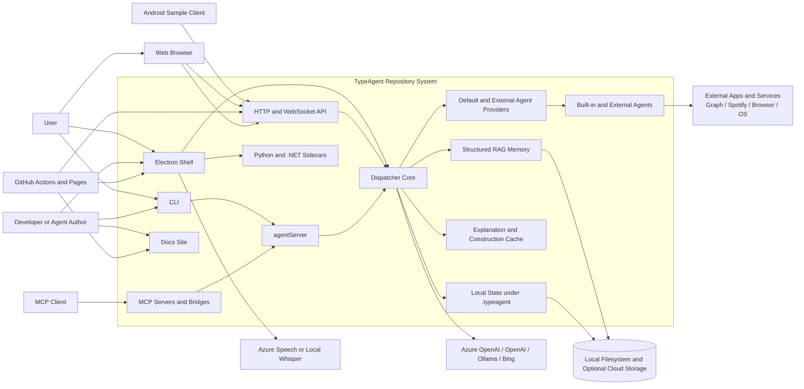
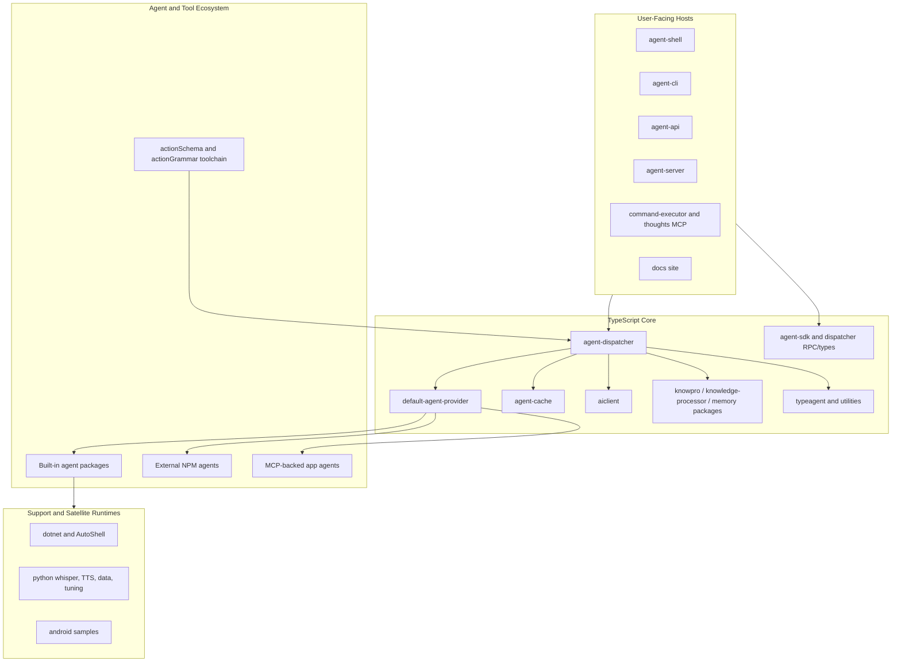
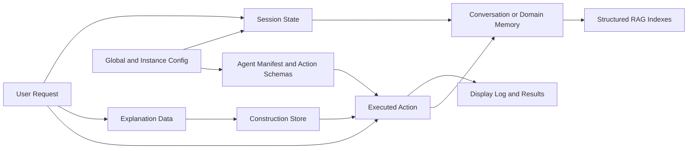
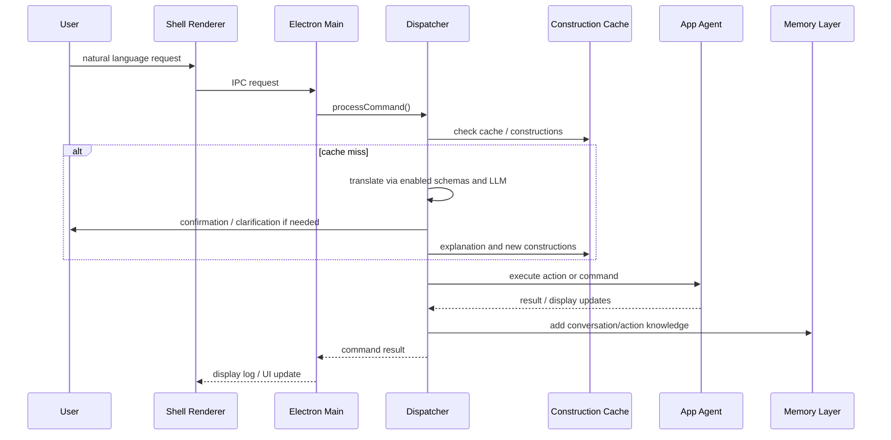
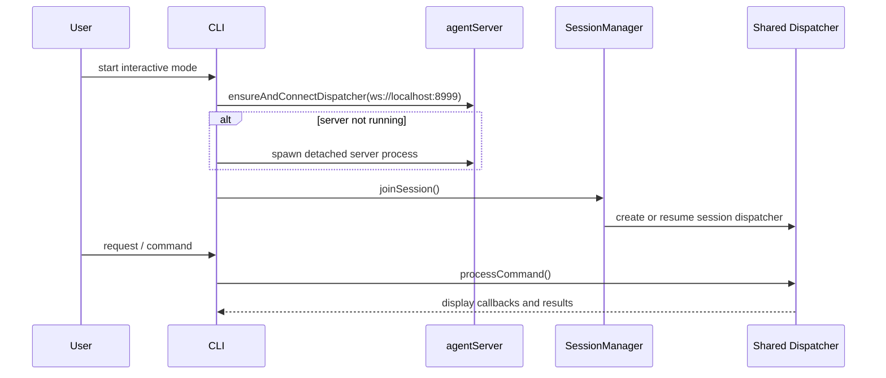
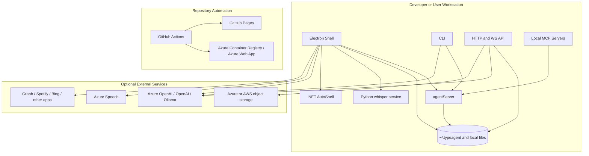

# ISO/IEC/IEEE 42010 Architecture Description

## 1. Identification

**System of interest:** `microsoft/TypeAgent`  
**Repository:** `https://github.com/microsoft/TypeAgent`  
**Architecture description type:** Source-based architecture description aligned to ISO/IEC/IEEE 42010 concepts  
**Inspected branch:** `main`  
**Inspected commit:** `2a77373c9c1ac4d8d11ad0b237a1794176d4f0d4`  
**Latest commit at snapshot:** `2026-04-07T00:59:17Z` - `Add shell packaging guard and automation workflow for Dependabot remediation (#2138)`  
**Snapshot date:** `2026-04-06` (America/Toronto)  
**Primary evidence:** root and package `README.md` files, TypeScript package manifests and source, docs content, workflow definitions, Dockerfile, and supporting Python/.NET/Android artifacts in the repository snapshot above

This document describes the implemented and intended architecture of TypeAgent as observed in the inspected repository snapshot. Where high-level prose, package inventory, and executable code differ, the active package manifests, runtime entry points, and CI/workflow definitions are treated as the authoritative source of truth.

## 2. Purpose and Scope

The purpose of this architecture description is to make the TypeAgent system understandable to contributors, agent authors, maintainers, operators, and evaluators by documenting:

- the system boundary and external dependencies
- the major runtime surfaces and extension points
- the module structure of the TypeScript monorepo and its supporting runtimes
- the principal information objects, state model, and persistence locations
- the runtime flows for dispatch, memory, sessioning, hosting, and tool integration
- the deployment and automation model
- the architectural rationale, inconsistencies, and risk areas

The scope includes:

- the TypeScript workspace in `ts`, which is the primary operational core
- the main hosts: Shell, CLI, HTTP API, `agentServer`, and MCP adapters
- the dispatcher, cache, memory, agent SDK, default provider, and built-in agents
- the docs site in `docs`
- the GitHub Actions and Azure DevOps pipeline definitions
- the .NET support code in `dotnet`
- the Python support code in `python`
- the Android samples in `android`

The scope excludes:

- the separate Python port referenced by the repo (`microsoft/typeagent-py`)
- the internals of external services such as Azure OpenAI, OpenAI, Microsoft Graph, Spotify, Bing, Azure Speech, Azure Key Vault, Azure Storage, or GitHub
- production hardening beyond what is implemented in the sample code and workflows

## 3. System Mission

TypeAgent is experimental sample code exploring how to build a single personal agent with natural language interfaces. Its implemented mission is broader than a single app and narrower than a general-purpose framework:

1. provide user-facing hosts for interacting with a personal agent
2. translate natural language requests into typed actions defined by agent schemas
3. dispatch those actions across an extensible set of application agents
4. reduce model cost and latency through explanation-derived local constructions
5. retain conversational and domain memory using Structured RAG
6. expose the same core agent behavior across shell, CLI, web/API, server, and MCP surfaces

Architecturally, TypeAgent is best understood as an experimental multi-host agent platform organized as a monorepo, with the TypeScript packages as the main executable system and the .NET, Python, and Android directories acting as supporting or exploratory satellites.

## 4. Architectural Style and Constraints

The dominant architectural characteristics visible in the repository are:

- dispatcher-centered orchestration rather than host-specific business logic
- plugin-style agents loaded from manifests and handler entry points
- local-first persistence under `~/.typeagent`
- structured prompting and typed action schemas rather than free-form tool calling alone
- explanation-driven caching to turn accepted translations into reusable local constructions
- Structured RAG for memory and recall instead of classic vector-only conversation memory
- multi-process execution by default for many agents, with in-process execution available for debugging
- monorepo packaging with many internal workspace packages rather than a single deployable binary

Important constraints visible in code and documentation:

| Category | Statement |
|---|---|
| Maturity | The repo repeatedly describes itself as sample code in active development with frequent refactoring |
| Primary runtime | The TypeScript workspace is the main operational implementation |
| Node toolchain | The TypeScript workspace requires Node `>=20` and pnpm `>=10` |
| Host model | Shell is Electron-based; CLI is Oclif-based; browser/web access is provided by the HTTP API and agent server |
| State model | User and session state are typically persisted locally under `~/.typeagent` |
| AI model dependency | Core translation and many memory features depend on Azure OpenAI or OpenAI-compatible endpoints unless local constructions or limited local modes suffice |
| Speech | Voice support is optional and depends on Azure Speech or a local Python whisper service |
| Native support | Some capabilities are Windows-only, especially AutoShell and Outlook/email support |
| Language support | The repository states current testing is primarily in English |
| Telemetry | The repo states no telemetry is collected by default; optional database logging exists for debugging scenarios |

## 5. Stakeholders and Concerns

| Stakeholder | Primary Concerns |
|---|---|
| End user of Shell/CLI/API | Natural language usability, latency, memory quality, stable actions, session continuity |
| Agent developer | Clear SDK contracts, manifest format, testability, ability to add custom agents |
| Host developer | Reusing dispatcher behavior across Electron, CLI, server, web, and MCP surfaces |
| Memory/AI researcher | Structured RAG quality, indexing precision, recall, prompt cost, model choice |
| Maintainer | Monorepo navigability, dependency management, CI reliability, refactor safety |
| Operator / release maintainer | Build/package automation, Docker/web deployment, shell packaging, docs publishing |
| Security / privacy reviewer | Local data handling, secret management, optional cloud dependencies, browser/electron safety |
| External service owner | Clean integration boundaries for Azure/OpenAI, Graph, Spotify, Bing, speech, storage, and identity |
| MCP client / ecosystem integrator | Stable local server behavior, clear tool surfaces, session sharing, command execution |
| Cross-language contributor | How Python, .NET, and Android components relate to the TypeScript core |

## 6. Context View

### 6.1 Context Viewpoint

**Stakeholders:** end user, host developer, operator, privacy reviewer, external service owner, MCP client developer  
**Concerns addressed:** system boundary, runtime surfaces, external systems, trust boundaries, local vs remote processing  
**Model kinds:** context diagram, actor/dependency table

### 6.2 Context View

### 6.3 Context Interpretation

The TypeAgent boundary is wider than a single app:

- The TypeScript workspace contains the primary executable runtime.
- The dispatcher is the architectural center of gravity.
- Shell, CLI, API, `agentServer`, and MCP adapters are alternative hosts around that core.
- Agents mediate access to external applications and services.
- Memory and cache are shared architectural services rather than host-specific features.
- Python and .NET components are support processes or experimental implementations, not co-equal first-class hosts.

TypeAgent is therefore not a single deployable service and not merely a library. It is a collection of cooperating local and optional remote processes arranged around a shared dispatcher model.

## 7. Assumptions, Constraints, and Guiding Principles

| Category | Statement |
|---|---|
| Guiding principle | Distill model behavior into logical structures that can later be reused locally |
| Guiding principle | Use structure to control information density for actions, memory, and plans |
| Guiding principle | Use structure to enable collaboration between humans, models, and software components |
| Personal agent scope | The repo explores one unified personal-agent experience spanning multiple application domains |
| Extension model | Agents are expected to be packaged, manifested, and dynamically loadable |
| Persistence model | State is typically local, profile-based, and file-backed |
| Cloud dependency | Many scenarios require external services, but the repo aims to keep core state local |
| Debug model | Local in-process execution is mainly a debugging mode; separate processes are preferred by default |
| Tooling | Repo operations assume a developer-centric environment with local builds, `.env` files, and service credentials |
| Production posture | The repository explicitly does not position itself as a finished framework or production product |

## 8. Viewpoint Catalog

| Viewpoint | Stakeholders | Main Concerns | Model Kinds |
|---|---|---|---|
| Context | All | System boundary, actors, external services, local/remote split | Context diagram, dependency table |
| Module and responsibility | Maintainers, agent authors, host developers | Package decomposition, host/core/support boundaries, extension model | Static structure diagram, responsibility tables |
| Information | Maintainers, privacy reviewers, operators | Session state, memory artifacts, manifests, configuration, persistence locations | Information model tables, persistence rules |
| Runtime | Host developers, users, operators | Request handling, agent loading, memory indexing, session sharing, host interactions | Sequence diagrams, runtime narratives |
| Deployment and operations | Operators, release maintainers | Local topologies, Docker/web topology, CI/CD, packaging, docs deployment | Deployment diagrams, workflow tables |
| Quality attribute | All major stakeholders | Extensibility, latency, explainability, privacy, portability, maintainability | Mechanism catalog, tradeoff tables |
| Decision and risk | Architects, maintainers, contributors | Architectural rationale, drift, gaps, future cleanup | Decision table, risk register |

## 9. Module and Responsibility View

### 9.1 Module and Responsibility Viewpoint

**Stakeholders:** maintainers, agent authors, host developers  
**Concerns addressed:** decomposition, compile-time dependencies, extension points, host/runtime boundaries  
**Model kinds:** static structure diagram, module tables, extension model summary

### 9.2 Static Structure View

### 9.3 Primary Modules

| Module / Area | Main Responsibilities | Key Evidence |
|---|---|---|
| `ts/packages/shell` | Electron host, renderer/main IPC, browser tabs, voice input, optional remote dispatcher connection | package README, `src/main/instance.ts` |
| `ts/packages/cli` | Oclif CLI host, interactive console, translator/explainer tooling, test-data management, remote connection to `agentServer` | package README, `src/commands/connect.ts` |
| `ts/packages/api` | HTTP + WebSocket server, browser-hosted chat UI, dispatcher bridge, optional cloud storage backup, Docker-target runtime | package README, `src/typeAgentServer.ts`, `src/webDispatcher.ts` |
| `ts/packages/agentServer/*` | Long-running shared dispatcher server over WebSocket with session management for multiple clients | package README, `server/src/server.ts` |
| `ts/packages/dispatcher/*` | Command parsing, request translation, cache check, session/config handling, system and dispatcher agents, action execution, client IO integration | `dispatcher/README.md`, `src/dispatcher.ts`, `src/context/*`, `src/translation/*`, `src/execute/*` |
| `ts/packages/defaultAgentProvider` | Built-in agent registry, optional MCP-backed provider, external-agent installer, indexing-service registry | `data/config.json`, `src/defaultAgentProviders.ts` |
| `ts/packages/agentSdk` | Agent manifest format, lifecycle APIs, command/action/display/storage interfaces | package README |
| `ts/packages/cache` | LLM explanation, construction creation, construction store, grammar export, explainer versioning | package README, `src/explanation/*`, `src/constructions/*` |
| `ts/packages/aiclient` | Environment-based configuration and wrappers for OpenAI/Azure/Bing access | package README |
| `ts/packages/knowPro` | Structured RAG core APIs for search, query translation, and answer generation | package README, `src/*` |
| `ts/packages/knowledgeProcessor` | Earlier Structured RAG implementation still used by dispatcher memory paths | package README |
| `ts/packages/memory/*` | Conversation, website, image, and storage-oriented memory implementations built on Structured RAG | package READMEs and source |
| Built-in agent packages under `ts/packages/agents/*` | Domain-specific action schemas and handlers for browser, code, desktop, calendar, email, list, media, image, markdown, settings, weather, and other sample domains | package manifests, default provider config |
| `ts/packages/commandExecutor` and `ts/packages/mcp/thoughts` | MCP-facing adapters that connect external tool clients to TypeAgent or expose adjacent utility capabilities | package READMEs |
| `docs` | Eleventy-generated documentation site with setup guides, tutorials, FAQs, and architecture notes | `docs/package.json`, `docs/content/*` |
| `dotnet` | AutoShell Windows automation and experimental .NET reimplementation of key memory/AI packages | `dotnet/README.md`, `dotnet/typeagent/README.md`, `dotnet/autoShell/README.md` |
| `python` | Local whisper service, TTS service, fine-tuning/data scripts, and other support experiments | `python/README.md`, subpackage READMEs |
| `android` | Mobile and WearOS samples showing Android as host or agent surface | `android/README.md` |

### 9.4 Built-In Agent Surface

The default provider configuration enables a concrete runtime set of built-in agents rather than every package in the repo. The default `config.json` enables these agent identities:

- `player` and `localPlayer`
- `calendar`
- `email`
- `list`
- `browser`
- `desktop`
- `code`
- `chat`
- `photo`
- `greeting`
- `image`
- `markdown`
- `montage`
- `video`
- `settings`
- `weather`
- `taskflow`
- `scriptflow`
- `utility`

The repo contains additional agent-related packages beyond that default configuration, including Android/mobile-oriented packages, test/demo agents, and experimental packages that are present in the workspace but not enabled by default.

### 9.5 Extension Model

The agent extension model is one of the repo's clearest architectural features:

| Extension Point | Mechanism |
|---|---|
| Built-in agents | NPM workspace packages declared in `defaultAgentProvider/data/config.json` |
| External agents | Per-instance `externalAgentsConfig.json` plus package install metadata |
| Agent contract | `./agent/manifest` and `./agent/handlers` exports described by `@typeagent/agent-sdk` |
| Execution boundary | Separate process by default; in-process allowed for debug or selected agents |
| MCP-backed agents | Default MCP provider wrapping configured MCP servers such as the filesystem server |
| Indexing services | Agent manifests can declare indexing services; the default provider builds a registry from those manifests |

### 9.6 Cross-Language Relationship

The multi-language structure is asymmetric:

- TypeScript is the main system and hosts nearly all end-user execution paths.
- .NET primarily provides Windows automation support and an experimental parallel implementation of memory-related libraries.
- Python provides optional local speech services and data/fine-tuning experiments.
- Android provides client/agent samples rather than the repo's main orchestration runtime.

This is not a polyglot runtime in the microservice sense. It is a TypeScript-centered architecture with supporting and exploratory sidecars.

## 10. Information View

### 10.1 Information Viewpoint

**Stakeholders:** maintainers, privacy reviewers, operators, agent authors  
**Concerns addressed:** persisted state, configuration, session identity, memory artifacts, extension metadata  
**Model kinds:** information catalog, persistence tables, lifecycle rules

### 10.2 Core Information Model

### 10.3 Core Information Objects

| Information Object | Purpose | Default Persistence |
|---|---|---|
| Global user config | Stores trace ID and mapping from enlistments to profile directories | `~/.typeagent/global.json` |
| Profile / instance directory | Stores profile-scoped runtime state for shell/dispatcher-based hosts | `~/.typeagent/profiles/<profile>/...` |
| Session metadata and session files | Preserve per-session config, cache/construction selection, and conversation-related state | Profile session directories; server sessions under `~/.typeagent/server-sessions/` |
| Agent manifests and action schemas | Declare emoji, schema metadata, flows, indexing services, and agent capabilities | Package exports and resolved schema/flow files in agent packages |
| Default provider config | Declares enabled built-in agents, explainers, test data, and default MCP servers | `ts/packages/defaultAgentProvider/data/config.json` |
| External agent config | Declares user-installed external agents | `<instanceDir>/externalAgentsConfig.json` |
| Instance config | Stores mutable per-instance config, including MCP-related settings | `<instanceDir>/config.json` |
| Explanation artifacts | Represent how a request mapped to an action and feed construction generation | In memory, test data JSON, and persisted construction stores |
| Construction store | Local grammar-like cache used to match future requests without an LLM call | Session-backed or explicit file path chosen by user |
| Display log / command results | UI-facing output history and dynamic display metadata | Host/session-managed local state |
| Conversation memory | Messages, metadata, extracted knowledge, and semantic references | File-backed serialized memory data under configured save locations |
| Website and image memory | Structured knowledge extracted from browsing history, bookmarks, pages, and images | Package-specific memory files and indexes; default persistence remains local |
| Experimental sqlite memory backing store | Explores a persistent storage backend for KnowPro | `memory-storage` package, not the default runtime path |
| Static docs site artifacts | Published HTML generated from docs content | GitHub Pages deployment artifact |
| Web UI build artifacts | Shell renderer assets reused by the HTTP API | `ts/packages/shell/out/renderer` |

### 10.4 Information Management Rules

| Rule | Mechanism |
|---|---|
| Stable per-user identity across local runs | `traceId` persisted in `~/.typeagent/global.json` |
| Stable profile mapping per enlistment | Global config maps instance names to profile directories |
| Session persistence is host-controlled | Hosts pass `persistSession` and `persistDir` into dispatcher creation |
| External agent installation is declarative | Installer updates `externalAgentsConfig.json` instead of editing code |
| Memory is incrementally updated | Conversation memory queues message updates and indexes them serially |
| Knowledge extraction can be decoupled from storage | Messages may carry prior knowledge; memory merges and clears it after indexing |
| Cloud backup is optional, not default | API server only enables remote blob backup when config explicitly requests it |
| Default persistence remains file-based | Experimental sqlite support exists separately and is not the default memory path |

### 10.5 Information Observations

- TypeAgent stores more state than a stateless prompt-driven CLI: profiles, sessions, caches, construction stores, memory indexes, and external agent config are all first-class information objects.
- Structured RAG shifts memory from raw chat history toward extracted topics, entities, relationships, and related-term indices.
- The repo also treats explanation test corpora as information assets; the CLI includes explicit workflows to add, regenerate, diff, and evaluate them.

## 11. Runtime View

### 11.1 Runtime Viewpoint

**Stakeholders:** host developers, users, maintainers, operators  
**Concerns addressed:** request flow, agent loading, cache usage, memory updates, host/server interaction  
**Model kinds:** sequence diagrams, scenario tables, runtime narratives

### 11.2 Primary Runtime Scenario: Shell Standalone

### 11.3 Primary Runtime Scenario: CLI via `agentServer`

### 11.4 Key Runtime Flows

| Scenario | Main Path |
|---|---|
| Shell startup, standalone | Electron main process creates ShellWindow, creates dispatcher in-process, wires client IO over IPC, optionally enables voice/browser helpers |
| Shell startup, connected mode | Shell connects to a remote `agentServer` instead of creating an in-process dispatcher |
| CLI interactive | CLI connects to `agentServer`, then runs a readline-based interactive loop against dispatcher RPC |
| Shared server session | `agentServer` resolves or creates a session, creates session-scoped dispatcher and clientIO channels, and allows multiple clients to join the same session |
| Cache-assisted request processing | Dispatcher checks construction cache; on miss it translates with LLM/schema, optionally explains accepted translations, and updates constructions |
| Agent execution | Dispatcher loads the target agent, often in a separate process, then calls action or command handlers through the agent SDK contract |
| Memory update | Dispatcher or host adds messages or artifacts to memory; conversation memory extracts knowledge, updates indices, and auto-saves |
| Web/API interaction | HTTP API serves static shell assets and a WebSocket bridge; one active web client is connected to the web dispatcher at a time |
| MCP bridge command execution | MCP server receives tool request, connects to TypeAgent dispatcher server, forwards command, and returns the result |
| Voice input | Shell uses Azure Speech or local whisper REST service for speech-to-text; optional local TTS services also exist |

### 11.5 Runtime Characteristics

- Host reuse is deliberate: different front ends reuse the same dispatcher logic instead of re-implementing agent routing.
- The system supports both in-process and out-of-process agent execution.
- Sessions are first-class runtime entities, not just logs.
- The runtime mixes synchronous conversational flows with asynchronous/background memory indexing.
- Multiple distributed models coexist:
  - shared multi-client server sessions in `agentServer`
  - single-web-client bridging in `agent-api`

### 11.6 Runtime Notes Backed by Code

| Runtime Property | Evidence |
|---|---|
| Shell can run standalone or connect remotely | `ts/packages/shell/src/main/instance.ts` |
| CLI interactive mode uses remote dispatcher connection | `ts/packages/cli/src/commands/connect.ts` |
| Agent processes default to separate execution unless overridden | `ts/packages/dispatcher/nodeProviders/src/agentProvider/npmAgentProvider.ts` |
| Local user data root is `~/.typeagent` | `ts/packages/dispatcher/dispatcher/src/helpers/userData.ts` |
| Conversation memory updates are queued and auto-saved | `ts/packages/memory/conversation/src/conversationMemory.ts` |
| `agentServer` exposes session lifecycle over WebSocket/RPC | `ts/packages/agentServer/server/src/server.ts` |

## 12. Deployment and Operations View

### 12.1 Deployment and Operations Viewpoint

**Stakeholders:** operators, release maintainers, contributors, evaluators  
**Concerns addressed:** local runtime topologies, packaging, docs deployment, CI/CD, cloud-facing paths  
**Model kinds:** deployment diagrams, mode tables, workflow tables

### 12.2 Deployment View

### 12.3 Supported Deployment / Execution Modes

| Mode | Description | Main Artifacts |
|---|---|---|
| Local shell | Electron app with dispatcher in-process, local state under `.typeagent`, optional local speech and native helpers | `ts/packages/shell` |
| Local CLI + server | CLI connects to `agentServer` on `ws://localhost:8999`, enabling shared sessions and remote-style operation | `ts/packages/cli`, `ts/packages/agentServer` |
| Browser/API host | Node HTTP + WebSocket server serving shell renderer assets on `http://localhost:3000` and optional HTTPS `3443` | `ts/packages/api`, `ts/Dockerfile` |
| Local MCP integration | MCP servers run locally and either connect to TypeAgent dispatcher or provide adjacent processing tools | `ts/packages/commandExecutor`, `ts/packages/mcp/thoughts` |
| Docs site | Eleventy-generated static docs deployed to GitHub Pages | `docs` |
| Native sidecar services | Optional Python whisper/TTS services and .NET AutoShell/Outlook helpers for host or agent features | `python`, `dotnet` |

### 12.4 CI/CD and Automation Surface

| Workflow / Asset | Main Function |
|---|---|
| `build-ts.yml` | Multi-OS Node build, lint, and local TypeScript test coverage |
| `build-dotnet.yml` | Windows build of AutoShell and TypeAgent .NET solutions plus AutoShell tests |
| `build-package-shell.yml` | Multi-OS shell build and packaging verification |
| `smoke-tests.yml` | Permission-gated smoke/live TypeScript tests with Azure login and retrieved secrets |
| `build-docker-container.yml` | Builds the TypeScript Docker image and pushes via Azure ACR build flow |
| `deploy-pages.yml` | Builds and deploys docs to GitHub Pages |
| `repo-policy-check.yml` | Policy and repo hygiene checks |
| `fix-dependabot-alerts.yml` | Scheduled remediation flow with build and shell packaging verification |
| `release-py.yml` | Python publishing workflow, though its configured project path is not present in this snapshot |
| `pipelines/*` | Azure DevOps pipeline files retained in-repo in addition to GitHub Actions |

### 12.5 Operational Notes

- Most developer scenarios use a local `.env` file under `ts`.
- The repo includes scripts to pull secrets from Azure Key Vault and supports Azure Identity-based keyless access for some services.
- `agentServer` persists server sessions under `~/.typeagent/server-sessions/`.
- The API Docker image builds the TypeScript workspace, packages `agent-api`, includes shell renderer assets, and is intended for local or Azure App Service hosting.
- The docs site is a separate Node project under `docs`, not generated from the main TypeScript workspace.

## 13. Quality Attribute View

| Quality Attribute | Architectural Support | Tradeoffs / Limits |
|---|---|---|
| Extensibility | Agent SDK manifests, handler exports, external agent config, MCP provider, built-in provider composition | Large plugin surface increases inventory drift and integration complexity |
| Explainability | Explicit explanation step, `@translate` and `@explain`, construction inspection and regeneration workflows | Explanations depend on model behavior and explainer versioning |
| Latency and cost | Construction cache, local pattern matching, optional local speech services, Structured RAG query precision | First-time requests and many memory operations still depend on external models |
| Memory quality | KnowPro and Structured RAG retain extracted structure, secondary indexes, related terms, and domain-specific metadata | Memory subsystem remains experimental and partially split between newer and older implementations |
| Host reuse | Shell, CLI, API, and server reuse dispatcher core instead of duplicating logic | Host-specific behavior still leaks in around IPC, WebSocket, and browser/native integration |
| Privacy / locality | Local-first state, local `.typeagent` directory, optional local whisper/TTS, telemetry off by default | Many realistic scenarios still require cloud keys and third-party services |
| Portability | TypeScript core is cross-platform; docs and Docker add portability; shell packaging is multi-OS | AutoShell and some integrations are Windows-only; speech/browser/service integrations vary by environment |
| Operability | CI workflows, packaging checks, smoke/live test separation, docs deployment, Docker path | Some live tests are non-blocking and some runtimes are built more than they are tested |
| Maintainability | Package boundaries are explicit and responsibilities are mostly well separated | The repo is large, fast-moving, multi-language, and has visible documentation drift |

## 14. Architecture Decisions and Rationale

| Decision | Rationale | Consequence |
|---|---|---|
| Center the system on a reusable dispatcher | Keep translation, routing, sessions, and memory consistent across hosts | Strong reuse; hosts still need transport-specific adaptation |
| Use manifest-based agents with typed schemas | Allow new domains to plug into the personal-agent experience | Requires discipline in manifest/schema maintenance and packaging |
| Run many agents in separate processes by default | Encourage isolated, remotely deployable agent implementations | Higher operational complexity than pure in-process plugins |
| Convert accepted explanations into constructions | Lower recurring LLM cost and latency for repeated patterns | Cache correctness depends on explainer quality and match validation |
| Use Structured RAG for memory | Improve recall density, precision, and queryability over classic turn embeddings | Memory layer becomes architecturally sophisticated and still experimental |
| Persist local user and session state | Preserve continuity across sessions and hosts | Introduces file-layout compatibility and migration concerns |
| Provide multiple host surfaces | Explore the same agent architecture in shell, CLI, web, server, and MCP contexts | The repo has multiple runtime topologies, not one deployment model |
| Keep .NET and Python work in-repo | Support native integrations and parallel research tracks close to the main codebase | Repo scope is broad and release boundaries become less obvious |
| Automate docs, builds, shell packaging, and container builds in GitHub Actions | Make the sample ecosystem easier to validate and publish | Automation complexity is significant and some flows depend on private cloud setup |

## 15. Correspondence and Consistency Rules

The following rules are used to keep this description internally consistent:

1. The TypeScript workspace is treated as the primary implementation unless a feature is explicitly implemented elsewhere and wired back into the TypeScript hosts.
2. A built-in agent is considered runtime-enabled only if it appears in the active default provider configuration, not merely because a package exists in the repo.
3. A runtime host is considered first-class if it has a concrete start path, package manifest, and code entry point in the inspected snapshot.
4. Optional external services are treated as dependencies only when a host, agent, or workflow explicitly references them.
5. Local persistence claims are anchored to the `.typeagent` helper code and host/session configuration, not just README prose.
6. Where documentation and code disagree, current package config, source entry points, and workflow files override stale prose.

## 16. Known Inconsistencies, Gaps, and Risks

| ID | Observation | Impact |
|---|---|---|
| R1 | The root README contains stale or broken references, including `./ts/packages/lic/`, `./azure/README.MD`, and agent links such as `phone` that do not exist in this snapshot. | Onboarding and architecture understanding from high-level docs are unreliable. |
| R2 | `release-py.yml` publishes from `python/ta`, but that path is absent, while the root README redirects users to the separate `microsoft/typeagent-py` repo. | Python release automation and current repo scope are inconsistent. |
| R3 | The distributed host model is inconsistent: `agentServer` is multi-client and session-oriented, while `agent-api` keeps only one active WebSocket client and closes the prior connection on a new one. | Different remote topologies expose different scalability and session semantics. |
| R4 | The repo contains more agent packages than the default runtime actually enables, and the root inventory does not match the active provider configuration. | Actual runtime capability is harder to infer than the package tree suggests. |
| R5 | GitHub Actions build the .NET `TypeAgent.sln`, but the workflow only executes explicit tests for AutoShell. TypeScript live tests in the smoke workflow are also marked `continue-on-error`. | Regression detection is uneven across runtimes and test classes. |
| R6 | Many meaningful smoke/live scenarios depend on Azure login, Key Vault retrieval, and private cloud configuration. | External contributors cannot reproduce the full operational path from source alone. |
| R7 | The repo mixes operational hosts, experimental memory backends, native sidecars, data/fine-tuning scripts, and MCP tools without a sharply documented release boundary. | The system-of-interest is coherent technically but ambiguous from a product/support standpoint. |

## 17. Planned Evolution

The repository trajectory suggests these architectural follow-up priorities:

1. Reconcile root documentation, provider configuration, and workflow inventory so the repo advertises the system it actually contains.
2. Clarify which runtime topologies are strategic: standalone shell, shared `agentServer`, browser/API host, MCP adapters, or all of them.
3. Decide whether Python support belongs in this repo as support scripts only or whether release automation should move fully to the external Python port.
4. Tighten the relationship between the current KnowPro-based memory stack and older knowledge-processor paths.
5. Expand regression coverage for the .NET libraries and any non-shell/web runtime surfaces that are expected to remain supported.
6. Continue separating truly reusable platform packages from one-off experimental or demo packages.

## 18. Traceability Summary

| Concern Area | Primary Evidence |
|---|---|
| Personal-agent mission and principles | root `README.md` |
| Dispatcher architecture and request flow | `docs/content/architecture/dispatcher.md`, `ts/packages/dispatcher/dispatcher/README.md`, dispatcher source |
| Structured RAG memory | `docs/content/architecture/memory.md`, `ts/packages/knowPro/README.md`, `ts/packages/memory/*` |
| Shell, CLI, and API hosts | `ts/packages/shell/README.md`, `ts/packages/cli/README.md`, `ts/packages/api/README.md` |
| Shared server sessions | `ts/packages/agentServer/README.md`, `server/src/server.ts` |
| Agent extension contract | `ts/packages/agentSdk/README.md`, default provider and node-provider source |
| Built-in runtime inventory | `ts/packages/defaultAgentProvider/data/config.json` |
| Native and support runtimes | `dotnet/README.md`, `dotnet/autoShell/README.md`, `python/*/README.md`, `android/README.md` |
| CI/CD and docs deployment | `.github/workflows/*.yml`, `docs/package.json`, `ts/Dockerfile`, `pipelines/*` |

## 19. Architecture Conclusions

TypeAgent is architecturally coherent around one main idea: a reusable dispatcher-backed personal agent that spans multiple hosts, uses typed actions and explanations, and treats memory as a structured retrieval problem rather than a chat-log afterthought. The TypeScript workspace makes that idea concrete through a strong separation between hosts, dispatcher core, cache, memory, and agent providers.

Its biggest architectural weakness is not the core design. It is boundary management. The repo has grown into a broad sample ecosystem containing local apps, shared servers, web/API paths, MCP bridges, native helpers, research packages, docs, and release workflows. That makes the implementation interesting and powerful, but it also creates drift between the runtime that exists, the runtime that is enabled by default, and the runtime the top-level docs imply.

Overall, the repository is best described as an experimental, dispatcher-centric, multi-host agent platform with a TypeScript operational core and several supporting research and integration satellites. The core ideas are consistent and technically defensible; the packaging, documentation, and support boundaries need continued cleanup.

## 20. Evidence Base

This architecture description was derived primarily from:

- `README.md`
- `docs/content/architecture/dispatcher.md`
- `docs/content/architecture/memory.md`
- `ts/package.json`
- `ts/packages/dispatcher/dispatcher/*`
- `ts/packages/shell/*`
- `ts/packages/cli/*`
- `ts/packages/api/*`
- `ts/packages/agentServer/*`
- `ts/packages/defaultAgentProvider/*`
- `ts/packages/agentSdk/*`
- `ts/packages/cache/*`
- `ts/packages/knowPro/*`
- `ts/packages/knowledgeProcessor/*`
- `ts/packages/memory/*`
- `ts/packages/agents/*`
- `ts/packages/commandExecutor/*`
- `ts/packages/mcp/thoughts/*`
- `docs/*`
- `dotnet/*`
- `python/*`
- `android/*`
- `.github/workflows/*`
- `pipelines/*`
- `ts/Dockerfile`
