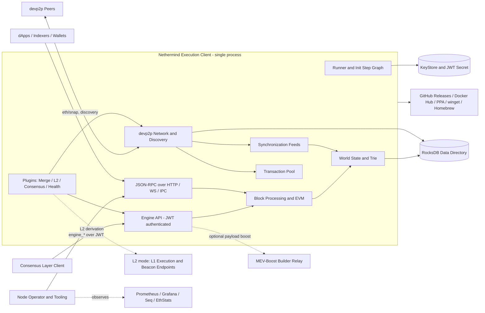
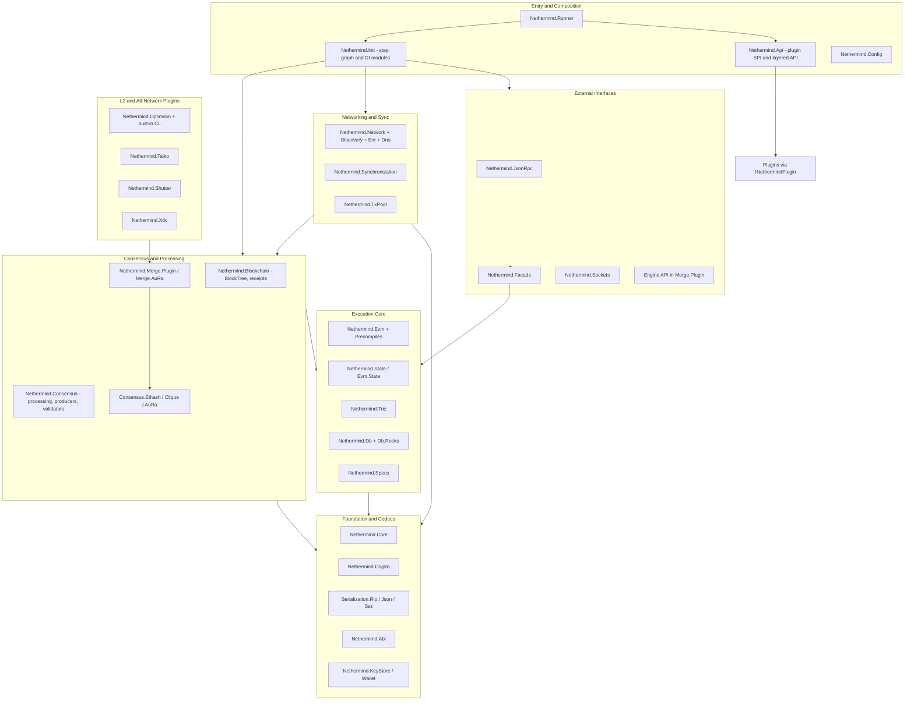
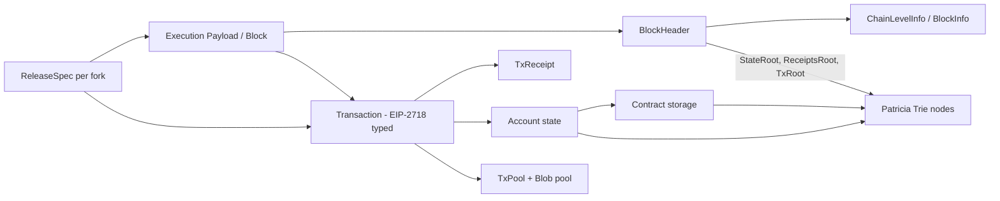
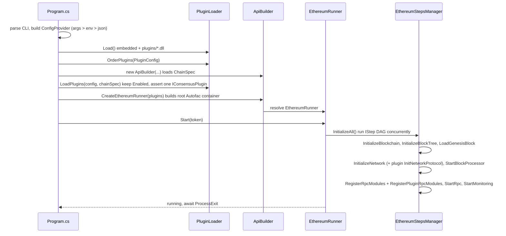
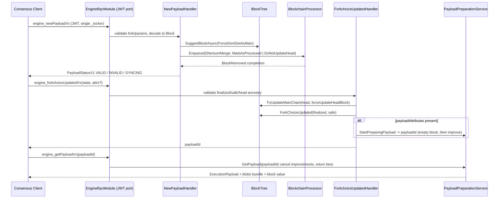
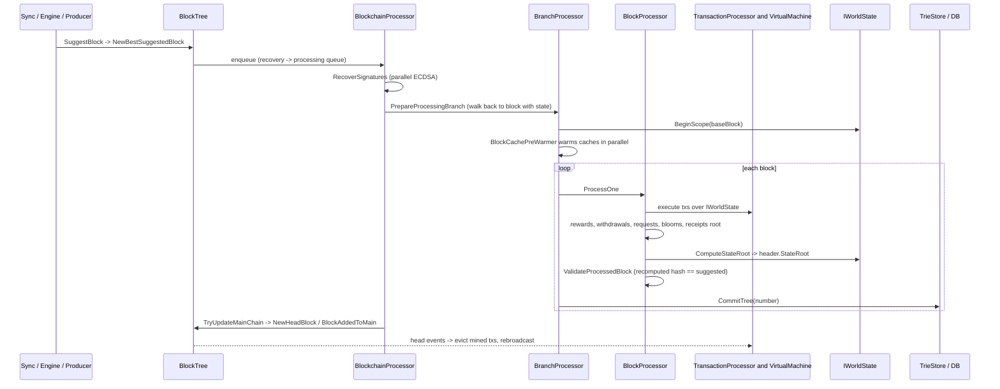
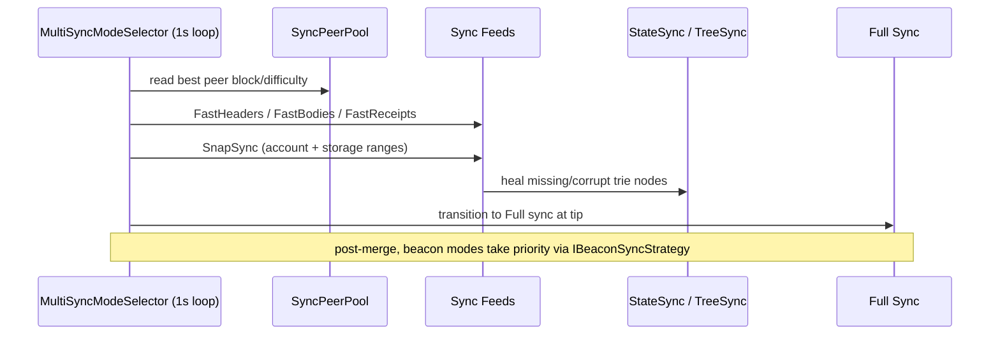
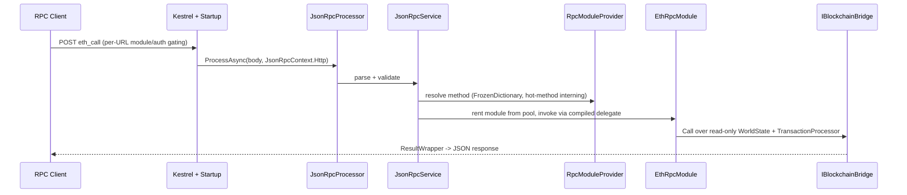
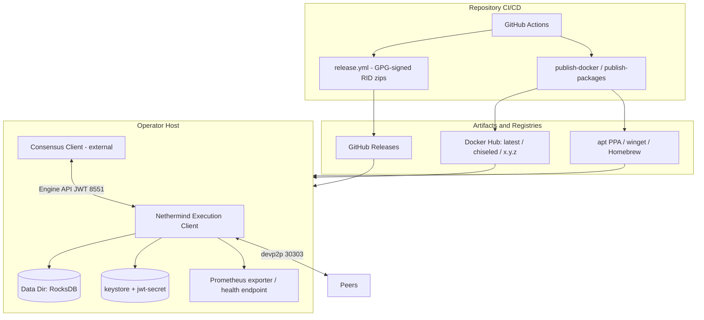

# ISO/IEC/IEEE 42010 Architecture Description

## 1. Identification

**System of interest:** `NethermindEth/nethermind`  
**Repository:** `https://github.com/NethermindEth/nethermind`  
**Architecture description type:** Source-based architecture description aligned to ISO/IEC/IEEE 42010 concepts  
**Inspected branch:** `master`  
**Inspected commit:** `6b183d57c541550e69616328023195012e4fee2d`  
**Latest commit at snapshot:** `2026-06-26T00:11:49+03:00` - `test: fix flaky SyncServerTests block range broadcast test (#12129)`  
**Snapshot date:** `2026-06-25` (America/Toronto)  
**Primary evidence:** the `src/Nethermind` solution (`Nethermind.slnx`), `Nethermind.Runner/Program.cs`, the `Nethermind.Api` plugin contracts, the `Nethermind.Init` step graph, the EVM/state/trie/db stack, the network/sync/txpool stack, the JSON-RPC and Engine API surfaces, the consensus/L2 plugins, `.agents/rules/*`, `AGENTS.md`, `README.md`, `Directory.Build.*`, the Dockerfiles, and the `.github/workflows` estate from the repository snapshot above

This document describes the implemented and intended architecture of the Nethermind Ethereum execution client as observed in the inspected repository snapshot. Where high-level prose, marketing claims, and executable code differ, the active package manifests, DI/module wiring, runtime entry points, plugin contracts, and CI/workflow definitions are treated as the authoritative source of truth.

## 2. Purpose and Scope

The purpose of this architecture description is to make the Nethermind system understandable to client operators, protocol and core engineers, plugin and L2 authors, security and consensus reviewers, and release operators by documenting:

- the system boundary and external actors (consensus-layer clients, peers, operators, tooling)
- the layered module structure of the .NET monorepo and its plugin extension model
- the principal information objects, on-disk state, and persistence layout
- the runtime flows for startup, the Engine API, block processing, synchronization, and JSON-RPC
- the deployment, distribution, and CI/CD model
- the architectural rationale, quality mechanisms, inconsistencies, and risk areas

The scope includes:

- the C# client codebase under `src/Nethermind` (the `Nethermind.slnx` solution and its tests)
- the runner/initialization layer (`Nethermind.Runner`, `Nethermind.Init`, `Nethermind.Api`)
- the execution core (`Nethermind.Evm`, `Nethermind.State`, `Nethermind.Trie`, `Nethermind.Db*`, `Nethermind.Specs`)
- the consensus/processing layer (`Nethermind.Blockchain`, `Nethermind.Consensus*`, `Nethermind.Merge.*`)
- the networking, discovery, and synchronization stack and the transaction pool
- the external interfaces (`Nethermind.JsonRpc`, the Engine API in `Nethermind.Merge.Plugin`, `Nethermind.Facade`, `Nethermind.Sockets`)
- the L2 / alternative-network plugins (`Nethermind.Optimism`, `Nethermind.Taiko`, `Nethermind.Shutter`, `Nethermind.Xdc`)
- the operational surface: configuration, monitoring, history/era, Dockerfiles, and GitHub Actions workflows

The scope excludes:

- the internals of external consensus-layer (beacon) clients, MEV-Boost relays, and L1 endpoints consumed by L2 plugins
- the Ethereum Foundation test fixtures vendored under `src/tests` (a git submodule) beyond their role as a conformance gate
- the separate documentation site (`docs.nethermind.io`) and the `Sedge` orchestrator beyond their published interfaces
- production deployment topologies operated by individual node operators

## 3. System Mission

Nethermind is a high-performance Ethereum **execution client** built on .NET, in production since 2017. In the post-merge Ethereum architecture it is the execution layer half of a node: it pairs with an external consensus-layer (beacon) client over the authenticated Engine API, maintaining and advancing the Ethereum world state while the consensus client owns fork choice and block timing. Its implemented mission is to:

1. accept and validate blocks/payloads from a consensus client (or peers during sync) and execute their transactions deterministically against world state
2. build execution payloads on request for proposer duties
3. expose chain state and history to operators, dApps, and tooling through high-throughput JSON-RPC over HTTP, WebSocket, and IPC
4. synchronize to the chain tip quickly via snap sync, then keep pace with the network
5. maintain a transaction pool and gossip transactions/blocks across the devp2p network
6. remain extensible — new consensus engines, transaction types, network protocols, RPC namespaces, and entire L2 networks load as plugins without forking the core

Architecturally, Nethermind is best understood as a **single-process, plugin-extensible Ethereum execution engine** organized as a large .NET monorepo, with a dependency-injected composition root, a uniform plugin SPI that even first-party features (L2s, Merge, health checks, the Hive test harness) consume, and a performance-obsessed execution core. The same binary serves Ethereum L1, Gnosis, and a large fleet of OP-Stack and other L2 networks selected entirely by configuration and chainspec.

## 4. Architectural Style and Constraints

The dominant architectural characteristics visible in the repository are:

- a single deployable process with an Autofac dependency-injection composition root rather than a service mesh
- a plugin architecture (`INethermindPlugin`) as the primary extension seam, with a layered plugin API (`IBasicApi` → `IApiWithStores` → `IApiWithBlockchain` → `IApiWithNetwork` → `INethermindApi`)
- a declarative, dependency-ordered **init-step graph** executed concurrently rather than a linear startup
- a performance-first execution core: function-pointer (`delegate*`) opcode dispatch, generic monomorphization for gas/tracing/EIP behavior, ref-struct zero-allocation stacks, SIMD, object pooling, and an offline PGO pipeline
- local-first persistence on RocksDB with pruning-aware Merkle Patricia trie storage
- feed-based synchronization driven by a sync-mode state machine, with snap sync as the default fast-path
- consensus modeled as data: a chainspec `engine` section selects exactly one consensus plugin; the post-merge PoS layer is a *decorator* over a legacy seal engine
- standards encoded as build/CI gates (custom Roslyn analyzers, warnings-as-errors, CodeQL/Trivy, conformance suites) rather than convention

Important constraints visible in code and configuration:

| Category | Statement |
|---|---|
| Runtime | One deployable client process; agents/plugins compose into a single Autofac container |
| Platform | .NET 10 (`global.json` pins SDK `10.0.300`), C# 14; multi-OS (Linux/Windows/macOS), x64 + arm64 |
| Consensus model | Post-merge consensus is driven by an external CL over the JWT-authenticated Engine API; the client does not own fork choice |
| Storage | RocksDB is the primary backend; per-purpose DB instances + column families; pruning-aware trie (`Hybrid` pruning default) |
| Sync | Snap sync is enabled by default through shipped network JSON (not code defaults), anchored to a periodically updated pivot |
| Networking | DotNetty devp2p/RLPx; `eth/66..71` and `snap/1` subprotocols; Discv4 (default) and Discv5 (opt-in) |
| Extensibility | New consensus engines, tx types/RLP decoders, P2P protocols, and RPC namespaces are added as plugins loaded on startup |
| Licensing | LGPL-3.0 (`LICENSE-LGPL`) with additional terms |
| Quality gates | Warnings-as-errors, six custom `NETH*` analyzers, CodeQL + Trivy + dependency-review, EF/Hive conformance, sync gates |

## 5. Stakeholders and Concerns

| Stakeholder | Primary Concerns |
|---|---|
| Node operator / staker | Sync speed, stability, resource footprint, Engine API correctness, upgrade safety, health/metrics |
| dApp / RPC consumer / indexer | JSON-RPC correctness and parity with Geth, throughput, latency, historical data availability |
| Consensus-layer client | Engine API conformance, JWT auth, payload-build latency, one-at-a-time call semantics |
| Core / protocol engineer | Hard-fork (EIP) implementation, EVM/state correctness, module boundaries, refactor safety |
| Plugin / L2 author | Stable plugin SPI, DI/module composition, chainspec-driven engine selection, extension without forking |
| Security / consensus reviewer | Invalid-block handling, key/JWT management, DoS resistance, supply-chain integrity, unsafe-code discipline |
| Performance engineer | Block-processing time, allocation/GC behavior, PGO, benchmark reproducibility |
| Release / DevOps operator | Reproducible builds, signed artifacts, Docker variants, package-manager and registry publishing |
| Network / ecosystem (Ethereum, Gnosis, OP Stack, Taiko, Linea, Energy Web, XDC) | Correct per-network forks/specs, client diversity, conformance to the network's consensus rules |
| QA / test maintainer | Conformance coverage (EF tests, Hive), sync gates across supported chains, benchmark drift detection |

## 6. Viewpoint Catalog

| Viewpoint | Stakeholders | Main Concerns | Model Kinds |
|---|---|---|---|
| Context | All | System boundary, external actors, CL/peer/operator interfaces, trust boundaries | Context diagram, dependency table |
| Module and responsibility | Core engineers, plugin authors | Decomposition, layering, plugin SPI, compile-time dependencies, extension model | Static structure diagram, module tables, extension model |
| Information | Engineers, reviewers, operators | World state, on-disk databases, chain structure, mempool, configuration | Information model, persistence/DB-layout tables |
| Runtime | Engineers, operators, CL clients | Startup, Engine API, block processing, sync, RPC, payload building | Sequence diagrams, scenario tables, runtime narratives |
| Deployment and operations | Operators, release engineers | Distribution artifacts, Docker variants, CI/CD, configuration, observability | Deployment diagram, mode/workflow tables |
| Quality attribute | All major stakeholders | Performance, reliability/consensus safety, security, modifiability, portability, testability | Mechanism catalog, tradeoff tables |
| Decision and risk | Architects, maintainers | Architectural rationale, drift, gaps, technical debt | Decision table, risk register |

## 7. Context View

### 7.1 Context Viewpoint

**Stakeholders:** node operator, CL client developer, RPC consumer, peer-network participant, security reviewer  
**Concerns addressed:** system boundary, external systems, local vs remote processing, trust boundaries, authenticated vs public interfaces  
**Model kinds:** context diagram, actor/dependency table

### 7.2 Context View

### 7.3 Context Interpretation

The Nethermind boundary is a single client process, but its interfaces are sharply differentiated by trust:

- **The Engine API is the consensus interface.** Post-merge, an external consensus-layer client drives the node over a dedicated, JWT-authenticated port. The CL owns fork choice and timing; Nethermind validates/executes payloads and builds blocks on request.
- **Public JSON-RPC is the operator/application interface**, served over HTTP, WebSocket, and IPC with per-URL module gating and DoS limits, distinct from the engine port.
- **devp2p is the peer interface.** Discovery (Discv4/Discv5), the `eth` wire protocol, and `snap` state serving connect the node to the network for sync, block gossip, and transaction gossip.
- **The data directory and keystore are the persistence boundary.** Core state lives locally in RocksDB; secrets (node key, JWT secret, account keystore) live on disk.
- **L2 plugins extend the boundary outward.** In L2 mode (e.g. Optimism), the client additionally consumes external L1 execution/beacon endpoints to derive L2 blocks, embedding a consensus driver that would otherwise be a separate process.

Nethermind is therefore not a microservice system and not a library; it is a single, plugin-composed execution engine whose most security-sensitive interface (Engine API) is isolated and authenticated, while its peer and RPC surfaces are hardened against untrusted input.

### 7.4 External Dependencies

| External Element | Purpose | Trust / Auth | Notes |
|---|---|---|---|
| Consensus-layer client | Drives fork choice and block production via Engine API | JWT (HS256) on dedicated port | Required for L1 mainnet operation |
| devp2p peers | Block/tx gossip, header/body/receipt and state (snap) sync | Untrusted; validated, rate-limited | ForkId/genesis/network checks on handshake |
| Local filesystem (RocksDB) | World state, blocks, receipts, indexes, peer/discovery data | Local | Primary persistence boundary |
| KeyStore + JWT secret file | Node key, account keys, engine auth secret | Local files | JWT secret auto-generated if absent |
| MEV-Boost / builder relay | Optional externally-built payloads during proposal | HTTP, opt-in via config | `BoostBlockImprovementContextFactory` |
| L1 execution + beacon endpoints | L2 derivation source (OP Stack, Taiko) | External RPC, plugin-gated | Only in L2 plugin mode |
| Prometheus / Pushgateway / Grafana / Seq / EthStats | Metrics and structured logging | Operator-configured | Telemetry off the hot path by default |
| GitHub Releases / Docker Hub / Launchpad PPA / winget / Homebrew | Distribution of signed artifacts and images | Release pipeline | See Deployment view |

## 8. Module and Responsibility View

### 8.1 Module and Responsibility Viewpoint

**Stakeholders:** core engineers, plugin/L2 authors, reviewers  
**Concerns addressed:** decomposition, layering, compile-time dependencies, the plugin extension model, host/core boundaries  
**Model kinds:** static structure diagram, module tables, plugin/extension model summary

The codebase in `src/Nethermind` contains 156 project directories across three solutions: `Nethermind.slnx` (client + tests), `EthereumTests.slnx` (Ethereum Foundation conformance suite), and `Benchmarks.slnx` (performance benchmarks).

### 8.2 Static Structure View

### 8.3 Primary Modules

| Module / Area | Main Responsibilities | Key Evidence |
|---|---|---|
| `Nethermind.Runner` | Executable entry point: CLI parsing, `ConfigProvider` assembly, plugin loading, ChainSpec load, root container build, `EthereumRunner`, Kestrel RPC host | `Program.cs`, `Ethereum/Api/ApiBuilder.cs`, `Ethereum/EthereumRunner.cs`, `NethermindPlugins.cs`, `JsonRpc/Startup.cs` |
| `Nethermind.Init` | Built-in `IStep` graph and `EthereumStepsManager`; production Autofac modules (Db, WorldState, BlockProcessing, BlockTree, Network, Discovery, Rpc, Prewarmer, Monitoring) | `Steps/EthereumStepsManager.cs`, `Steps/EthereumStepsLoader.cs`, `Modules/*.cs`, `Modules/BuiltInStepsModule.cs` |
| `Nethermind.Api` | Plugin SPI (`INethermindPlugin`, `IConsensusPlugin`), `PluginLoader`, and the layered API stack | `Extensions/INethermindPlugin.cs`, `Extensions/PluginLoader.cs`, `IBasicApi.cs` … `INethermindApi.cs`, `NethermindApi.cs` |
| `Nethermind.Blockchain` | Canonical chain structure: `BlockTree`, header/block/receipt stores, fork/reorg metadata, full pruning, block finding | `BlockTree.cs`, `Receipts/PersistentReceiptStorage.cs`, `FullPruning/*` |
| `Nethermind.Consensus` | Processing pipeline (`BlockchainProcessor`, `BranchProcessor`, `BlockProcessor`), producers, validators, rewards, withdrawals, tx sourcing, prewarming | `Processing/*`, `Validators/*`, `Producers/*`, `Processing/BlockCachePreWarmer.cs` |
| `Nethermind.Consensus.Ethash / Clique / AuRa` | Pluggable seal engines: PoW (legacy), Clique PoA (→ Linea), Authority Round (→ Gnosis, Energy Web) | `EthashPlugin.cs`, `CliquePlugin.cs`, `AuRaPlugin.cs` and their sealers/validators |
| `Nethermind.Merge.Plugin` / `Merge.AuRa` | Engine API, PoS integration as a decorator over a legacy engine, beacon sync, `PayloadPreparationService`, `PoSSwitcher`, invalid-chain tracking | `EngineRpcModule*.cs`, `Handlers/*`, `BlockProduction/PayloadPreparationService.cs`, `MergePlugin.cs` |
| `Nethermind.Evm` + `Evm.Precompiles` | EVM interpreter: per-spec function-pointer opcode table, ref-struct stack, gas policies, transaction processing, precompiles | `VirtualMachine.cs`, `Instructions/*`, `EvmStack.cs`, `GasPolicy/IGasPolicy.cs`, `TransactionProcessing/TransactionProcessor.cs` |
| `Nethermind.State` / `Evm.State` / `State.Flat` | World-state facade and scope providers (trie / healing / prewarmer / experimental flat), `StateProvider`, `PersistentStorageProvider`, `StateReader` | `WorldState.cs`, `TrieStoreScopeProvider.cs`, `Evm/State/IWorldStateScopeProvider.cs` |
| `Nethermind.Trie` | Merkle Patricia trie: `PatriciaTree`, `TrieNode`, pruning-aware `TrieStore` (256-shard dirty cache), `INodeStorage` (Hash/HalfPath schemes) | `PatriciaTree.cs`, `Pruning/TrieStore.cs`, `INodeStorage.cs` |
| `Nethermind.Db` + `Db.Rocks` | DB abstractions, `DbNames`, column-family DBs, pruning config/machinery, RocksDB backend with per-table tuning | `DbNames.cs`, `PruningConfig.cs`, `Db.Rocks/DbOnTheRocks.cs`, `ColumnsDb.cs` |
| `Nethermind.Specs` | Fork/spec selection: `ReleaseSpec` (~87 EIP flags), per-fork singletons, `ForkSchedule`, `MainnetSpecProvider`, ChainSpec-driven providers | `ReleaseSpec.cs`, `ForkSchedule.cs`, `MainnetSpecProvider.cs`, `ChainSpecStyle/*` |
| `Nethermind.Network` (+ `Discovery`, `Enr`, `Dns`, `Stats`, `Contract`) | devp2p/RLPx transport, `eth/66..71` + `snap/1` handlers, capability negotiation, peer management, discovery (Discv4/Discv5), ENR, DNS discovery | `Rlpx/*`, `ProtocolsManager.cs`, `P2P/Subprotocols/*`, `Discovery/CompositeDiscoveryApp.cs` |
| `Nethermind.Synchronization` | Sync-mode state machine and feed pipeline (fast headers/bodies/receipts, fast sync, snap, state heal, full), `SyncServer`, peer pool | `ParallelSync/MultiSyncModeSelector.cs`, `SnapSync/*`, `FastSync/*`, `SyncServer.cs` |
| `Nethermind.TxPool` | Mempool: staged filter pipeline, gas-price-ordered pools, persistent/reorg-aware blob pool, broadcaster gossip | `TxPool.cs`, `TxBroadcaster.cs`, `Collections/*`, `Filters/*` |
| `Nethermind.JsonRpc` (+ `SourceGenerator`, `Facade`, `Sockets`) | JSON-RPC engine, module model and registration, transports, source-generated STJ contexts; read/simulation facade | `JsonRpcProcessor.cs`, `JsonRpcService.cs`, `Modules/RpcModuleProvider.cs`, `Facade/BlockchainBridge.cs` |
| `Nethermind.Optimism` / `Taiko` / `Shutter` / `Xdc` | L2 and alternative-network plugins: OP-Stack with built-in CL, Taiko, Shutter encrypted mempool, XDC XDPoS | `OptimismPlugin.cs`, `CL/*`, `TaikoPlugin.cs`, `ShutterPlugin.cs`, `XdcPlugin.cs` |
| `Nethermind.Core` / `Crypto` / `Serialization.*` / `Abi` / `KeyStore` / `Wallet` | Domain value types, ECDSA/Keccak/BLS/KZG, RLP/JSON/SSZ codecs, ABI, Web3 V3 keystore, wallet | `Core/Transaction.cs`, `Crypto/*`, `Serialization.Rlp/*`, `Serialization.Ssz/*` |
| Operational modules | Monitoring (Prometheus), HealthChecks, Seq, EthStats, Grpc, Era1/EraE/History, UI | `Nethermind.Monitoring/*`, `Nethermind.HealthChecks/*`, `Nethermind.Era1/*`, `Nethermind.History/*` |

### 8.4 Plugin and Extension Model

The plugin system is the single most distinctive architectural feature. A plugin is any `INethermindPlugin` implementation; first-party features are compiled in via `NethermindPlugins.EmbeddedPlugins`, and third-party plugins are loaded from `plugins/*.dll` on startup.

| Extension Point | Mechanism |
|---|---|
| Plugin lifecycle | `InitTxTypesAndRlpDecoders(api)`, `Task Init(api)`, `Task InitNetworkProtocol()`, `Task InitRpcModules()`, plus an optional Autofac `IModule? Module` — each invoked from a specific init step |
| Consensus engine | `IConsensusPlugin` (a near-empty marker adding `ApiType`); the chainspec `engine` section selects exactly one, enforced by `PluginLoader` and re-asserted in `NethermindRunnerModule` and invariant checks |
| Layered API | `IBasicApi` (process infra) → `IApiWithStores` (BlockTree, receipts, signer) → `IApiWithBlockchain` (processing, production, txpool) → `IApiWithNetwork` (protocols, RPC provider, sync) → `INethermindApi` |
| Tx types / RLP decoders | `RegisterTxType<T>` and decoder registration via `InitTxTypesAndRlpDecoders` |
| P2P protocols / capabilities | Ordered `IP2PCapabilityResolver` list + per-version `IProtocolHandlerFactory` |
| JSON-RPC namespaces | `RegisterSingletonJsonRpcModule` / `RegisterBoundedJsonRpcModule` feeding `RpcModuleProvider` |
| Composition | Each plugin's `IModule` is merged into the single root container; decorator plugins (`Merge`, `AuRaMerge`, `Shutter`) use `AddDecorator` over the base engine's bindings |

The embedded plugin set (`NethermindPlugins.EmbeddedPlugins`) includes: `BalRecorderPlugin`, `AuRaPlugin`, `CliquePlugin`, `EthashPlugin`, `NethDevPlugin`, `EthStatsPlugin`, `Flashbots`, `HealthChecksPlugin`, `HivePlugin`, `SnapshotPlugin`, `AuRaMergePlugin`, `MergePlugin`, `OptimismPlugin`, `ShutterPlugin`, `TaikoPlugin`, `UPnPPlugin`, `XdcPlugin`, `XdcSubnetPlugin`, and `StateCompositionPlugin`.

### 8.5 Consensus and L2 Composition

A crucial architectural nuance: the post-merge PoS layer is **not** a consensus engine in the plugin sense. `MergePlugin`, `AuRaMergePlugin`, and `ShutterPlugin` are plain `INethermindPlugin`s that *decorate* the selected legacy seal engine (Ethash/Clique/AuRa) with the Engine API, beacon sync, and `PoSSwitcher` via a shared `BaseMergePluginModule`. The genuine single `IConsensusPlugin` is the seal engine (`Ethash`, `Clique`, `AuRa`) or an L2 plugin (`Optimism`, `Taiko`, `Xdc`). L2 plugins reuse `BaseMergePluginModule` and override only the deltas (`IBlockProcessor`, `ITransactionProcessor`, validators, payload preparation, precompiles), so an entire L2 ships without forking the core. Optimism additionally embeds an in-process consensus driver (`OptimismCL`) that derives L2 blocks from L1, replacing the separate `op-node`.

## 9. Information View

### 9.1 Information Viewpoint

**Stakeholders:** core engineers, reviewers, operators  
**Concerns addressed:** world state representation, persisted databases, chain structure, mempool, configuration, secrets  
**Model kinds:** information model, persistence/DB-layout tables, lifecycle notes

### 9.2 Core Information Model

### 9.3 Core Information Objects

| Information Object | Owner / Producer | Persistence | Description |
|---|---|---|---|
| `Block` / `BlockHeader` / `BlockBody` | `Nethermind.Core` | `blocks`, `headers` DBs | Header carries `StateRoot`, `ReceiptsRoot`, `TxRoot`, `Bloom`, EIP-4844 blob-gas fields, `WithdrawalsRoot`, `RequestsHash`, `ParentBeaconBlockRoot`, etc. |
| `Transaction` | `Nethermind.Core` | In mempool; in block bodies | A single "fat" type covering all EIP-2718 types (Legacy/AccessList/1559/Blob/SetCode) plus L2 fields (Optimism deposit, Taiko anchor); object-pooled, lazily hashed |
| `TxReceipt` | `BlockProcessor` | `receipts` column DB | EIP-658 status + bloom + logs; diagnostic gas fields explicitly excluded from consensus RLP |
| Account / storage | `StateProvider` / `PersistentStorageProvider` | `state`, `storage` DBs via trie | Account RLP `{nonce, balance, storageRoot, codeHash}`; code stored separately in `code` DB keyed by code hash |
| Patricia trie nodes | `TrieStore` | `state`/`storage` via `INodeStorage` | Keyed by `Hash` or `HalfPath` scheme; pruning-aware persistence on reorg/finalization boundaries |
| `ChainLevelInfo` / `BlockInfo` | `BlockTree` | `blockInfos` DB | Per-block-number fork set, canonicality, total difficulty, beacon-sync metadata |
| Mempool pools | `TxPool` | In-memory; blob pool persistent (`blobTransactions`) | Gas-price-ordered distinct sorted pools; separate `StorageWithReorgs` blob pool surviving restarts/reorgs |
| `ReleaseSpec` | `Nethermind.Specs` | In-memory singletons | Immutable per-fork spec with ~87 EIP/feature flags selected by `ForkSchedule` (block number or timestamp) |
| Execution payload / `ForkchoiceState` / `PayloadAttributes` | `Merge.Plugin` | Transient; payload store in memory | Engine API DTOs; `payloadId` keys the `PayloadPreparationService` improvement store |
| Peer / discovery records | `Network`/`Discovery` | `peers`, `discoveryNodes`, `discoveryV5Nodes` DBs | Persisted ENR/NetworkNode records with reputation |
| Configuration | `Nethermind.Config` | JSON config + chainspec + CLI/env | `IConfig` interfaces populated from layered sources |
| Secrets | `KeyStore`, `Core.Authentication` | `keystore/`, JWT secret file, node key | Web3 V3 keystore (scrypt+AES); HS256 JWT secret auto-generated if absent |

### 9.4 On-Disk Database Layout

RocksDB is the primary backend, split into **per-purpose database instances** (`DbNames`) plus column-family DBs (`ColumnsDb<T>`) for receipts, blob transactions, and the experimental flat state. The per-purpose stores observed in `DbNames` include: `state`, `storage`, `flat`, `code`, `blocks`, `headers`, `blockNumbers`, `blockAccessLists`, `receipts`, `blockInfos`, `badBlocks`, `metadata`, `blobTransactions`, `discoveryNodes`, `discoveryV5Nodes`, `peers`, `logIndex`, and `preimage`.

| Concern | Store(s) | Notes |
|---|---|---|
| World state | `state`, `storage` (trie nodes), `code` | Pruning-aware via `TrieStore`; `Hash` or `HalfPath` node-key scheme; optional `flat` layout (default off) |
| Chain data | `blocks`, `headers`, `blockNumbers`, `blockInfos`, `badBlocks` | Canonical chain bookkeeping and bad-block records |
| Receipts / logs | `receipts` (column DB), `logIndex` | Receipt persistence + log index for `eth_getLogs` |
| Mempool durability | `blobTransactions` | Blob pool default `StorageWithReorgs` |
| Networking | `peers`, `discoveryNodes`, `discoveryV5Nodes` | Persisted peer/discovery records |
| Misc | `metadata`, `preimage`, `blockAccessLists` | Sync pointers, history delete-pointers, EIP-7928 access lists |

### 9.5 Information Management Rules

| Rule | Mechanism |
|---|---|
| Fork rules are immutable per-fork singletons | `ForkSchedule` maps `(blockNumber, timestamp)` to a singleton `IReleaseSpec` |
| State is journaled and snapshot-able | `WorldState` enforces `BeginScope`/`EndScope`; `TakeSnapshot`/`Restore` for EVM revert |
| State persistence is pruning-bounded | Memory + full pruning (`Hybrid` default); dirty nodes flushed to disk on reorg/finalization boundary |
| Engine drives the head; sync respects beacon control | Head moves only via `BlockTree.TryUpdateMainChain`; FCU forces head, `newPayload` does not |
| Snap sync converges then heals | Snap state download followed by trie healing (`StateSync`/`TreeSync`) before transitioning to full sync |
| Configuration precedence is fixed | Args > Env (`NETHERMIND_*`) > JSON file > compiled defaults |
| Three codecs scoped to concerns | RLP for consensus/devp2p, System.Text.Json for JSON-RPC, SSZ for Engine API / beacon-blob structures |

## 10. Runtime View

### 10.1 Runtime Viewpoint

**Stakeholders:** core engineers, operators, CL client developers  
**Concerns addressed:** startup ordering, Engine API flow, block processing, sync, RPC, payload building  
**Model kinds:** sequence diagrams, scenario tables, runtime narratives

### 10.2 Startup: Process Boot to Running Node

The init layer expresses startup as a graph of ~22 `IStep` classes (`BuiltInStepsModule.BuiltInSteps`), ordered by `[RunnerStepDependencies]` attributes and executed concurrently subject to those dependencies — not as a linear sequence. Representative steps: `ApplyMemoryHint`, `InitializeBlockchain`, `InitializeBlockTree`, `LoadGenesisBlock`, `InitializeNetwork`, `StartBlockProcessor`, `InitializeBlockProducer`, `RegisterRpcModules`, `RegisterPluginRpcModules`, `StartRpc`, `StartMonitoring`.

### 10.3 Engine API: newPayload → forkchoiceUpdated → getPayload (post-merge)

Engine API calls share a single `SemaphoreSlim(1,1)` (8s timeout), matching the CL's one-at-a-time contract; `newPayload` additionally runs inside a no-GC region. The API is fork-versioned through partial classes (`EngineRpcModule.Paris/Cancun/Prague/Osaka/...`), and capabilities are fork-gated at runtime by `EngineRpcCapabilitiesProvider`.

### 10.4 Block Processing Pipeline

Block production reuses the same processor with the `ProducingBlock` option composite (`NoValidation | ReadOnlyChain | ForceProcessing | DoNotUpdateHead`), differing only in the `ITxSource`, `ISealer`, and trigger per consensus engine. The post-execution validity check is a single hash-equality test (recomputed header hash == suggested hash); detailed field diffs run only for diagnostics.

### 10.5 Synchronization (snap sync default)

Snap-sync-by-default is realized through shipped network JSON (e.g. `mainnet.json` `Sync.SnapSync=true`) plus a periodically updated hard-coded pivot — not through code defaults (`SyncConfig` defaults are full sync). `SyncServer` serves peers and deliberately distrusts gossiped total difficulty, recomputing it from the known parent before validating/suggesting gossiped blocks.

### 10.6 Inbound JSON-RPC (eth_call)

### 10.7 Key Runtime Scenarios

| Scenario | Main Path |
|---|---|
| Node startup | `Program.cs` → `PluginLoader` → `ApiBuilder` → `EthereumRunner.Start` → concurrent `EthereumStepsManager` DAG |
| Validate/insert payload | `engine_newPayloadVx` → validate → `SuggestBlockAsync` → enqueue (`MarkAsProcessed | DoNotUpdateHead`) → status |
| Update head + build payload | `engine_forkchoiceUpdatedVx` → `TryUpdateMainChain` + finalization → optional `PayloadPreparationService` build |
| Block import | `BlockchainProcessor` → `BranchProcessor` → `BlockProcessor.ProcessOne` → EVM over `IWorldState` → commit → head update |
| Snap sync | `MultiSyncModeSelector` → fast headers/bodies/receipts + snap ranges → state heal → full sync |
| New-block gossip | `Eth*ProtocolHandler` → `SyncServer.AddNewBlock` (recompute TD, validate seal) → rebroadcast / suggest |
| Tx submission | `TxPool.SubmitTx` → pre-hash + post-hash filters → gas-price-ordered pool → broadcaster gossip |
| eth_call / estimateGas | transport → `JsonRpcProcessor` → `EthRpcModule` → `BlockchainBridge.Call` over read-only scope |
| L2 derivation (Optimism) | `OptimismCL` polls L1 → `DerivationPipeline` → `engine_forkchoiceUpdated`/`getPayload`/`newPayload` |

### 10.8 Runtime Characteristics

- The client is a single OS process; concurrency is internal (block processing on a dedicated high-priority thread, parallel prewarming, async network/RPC).
- Engine API calls are globally serialized; public RPC uses sharable singleton modules plus bounded exclusive pools with DoS limits.
- The processing pipeline is two-staged (parallel signature recovery → serial state mutation) and walks back only to the nearest block that still has state.
- Sync is feed-based and mode-driven; post-merge, beacon control overrides standard mode selection.
- Memory/full pruning bounds state growth; history pruning (`HistoryPruner`) runs opportunistically when the processing queue empties.

## 11. Deployment and Operations View

### 11.1 Deployment and Operations Viewpoint

**Stakeholders:** node operators, release engineers, DevOps  
**Concerns addressed:** distribution artifacts, runtime topology, configuration, observability, CI/CD  
**Model kinds:** deployment diagram, mode/workflow tables

### 11.2 Deployment View

### 11.3 Distribution / Execution Modes

| Mode | Artifacts | Characteristics |
|---|---|---|
| Standalone binary | GPG-signed zips for 5 RIDs (linux-x64/arm64, osx-x64/arm64, win-x64) on GitHub Releases | ReadyToRun + Static PGO; multi-OS |
| Docker (standard) | `Dockerfile` → Docker Hub `latest` / `x.y.z` | Hugepage/cgroup-aware GC tuning via `entrypoint.sh` |
| Docker (chiseled) | `Dockerfile.chiseled` → `latest-chiseled` | Rootless distroless, minimal attack surface (`USER app`) |
| Docker (diag / pgo) | `Dockerfile.diag`, `Dockerfile.pgo` | Profiling image (dotnet-dump/trace, dotMemory/dotTrace); PGO-collection image |
| Package managers | apt PPA (`ppa:nethermindeth/nethermind`), winget (`Nethermind.Nethermind`), Homebrew tap | OS-native install |
| Run command | `nethermind -c mainnet --data-dir <path>` | Config selected by network name or file |

### 11.4 CI/CD and Automation Surface

The `.github/workflows` estate (~44 workflows) implements a deep quality and delivery pipeline:

| Category | Representative Workflows |
|---|---|
| Build / unit + EF spec tests | `build-solutions.yml`, `build-nethermind-packages.yml`, `nethermind-tests.yml` (matrixed across OS/arch + chunked Pyspec/Blockchain tests) |
| Consensus / integration conformance | `hive-consensus-tests.yml`, `hive-tests.yml`, `test-assertoor.yml`, `stateless-tests.yml`, `rpc-comparison.yml` |
| Sync gates | `sync-pr-gate.yml`, `sync-master-validation.yml`, `sync-supported-chains.yml` |
| Benchmarks / PGO | `run-block-processing-benchmark.yml`, `run-gas-benchmarks.yml`, `evm-opcode-benchmark-diff.yml`, `collect-pgo-profile.yml`, `run-expb-reproducible-benchmarks.yml` |
| Security scanning | `codeql.yml`, `trivy.yml`, `dependency-review.yml` |
| Release / publish | `release.yml` (manual approval, GPG-signed), `publish-docker.yml`, `publish-packages.yml`, `bump-version.yml` |
| Automation | `update-*` (dockerfiles, docs, fast-sync pivot, bootnodes, superchain), `pr-labeler.yml`, `claude-review.yml`, `code-formatting.yml`, `code-lint.yml` |

### 11.5 Configuration and Operational Model

- Configuration is reflection-driven `IConfig` interfaces populated from layered sources (Args > Env > JSON file > compiled defaults); the runner ships ~89 network config JSON files spanning Ethereum L1/testnets, Gnosis, Energy Web, a large OP-Stack L2 fleet, Taiko, Linea, XDC, and `_archive` variants.
- The Engine API requires a JWT secret (`JsonRpc.JwtSecretFile`), auto-generated as a 256-bit HS256 secret if absent.
- Observability spans Prometheus (pull + Pushgateway), .NET counters, ASP.NET health checks (`/health`, disk-space + CL-liveness, webhook alerts), Seq, EthStats, an optional gRPC server, and a built-in web UI; telemetry sources are disabled on the hot path by default for performance.
- History management includes era1/EraE archive export/import and online `HistoryPruner` (EIP-4444-style history expiry).
- Reproducible builds thread `SOURCE_DATE_EPOCH`/commit hash through images and releases; base images and GitHub Actions are digest/SHA-pinned; NuGet restores in locked mode under central package management.

## 12. Quality Attribute View

| Quality Attribute | Architectural Support | Tradeoffs / Limits |
|---|---|---|
| Performance | Function-pointer opcode dispatch, generic gas/tracing/EIP monomorphization, ref-struct zero-alloc `EvmStack`, SIMD (Vector256/512), object pooling, Server+Concurrent GC, TieredPGO + Static PGO `.mibc`, parallel `BlockCachePreWarmer` | Heavy `unsafe`/generics concentrate correctness risk; the "~2x" prewarm figure is a marketing claim not asserted in code |
| Reliability / consensus safety | `InvalidBlockInterceptor` + `InvalidChainTracker` propagate invalidity to descendants; hash-equality validity check; deterministic processing; bad-block store | `BlockTree.cs` (~1900 lines) is a multi-concern hotspot; some read paths mutate the DB (documented TODOs) |
| Security | JWT-isolated Engine API (HS256, constant-time compare, 60s TTL), Web3 V3 keystore, rootless chiseled image, CodeQL/Trivy/dependency-review, SHA-pinned actions, DoS limits on public RPC | Auto-generated JWT secret depends on file permissions; key components flagged `[DoNotUseInSecuredContext]`; AI-gated merge is non-deterministic |
| Modifiability | Plugin SPI used even by first-party features, layered API, Autofac DI with a custom DSL, decorator-based merge/L2 composition, chainspec-driven engine selection | `IConsensusPlugin` is a near-empty marker — the real contract lives in module bindings, caught only at resolve time |
| Portability | Multi-OS / x64+arm64 RIDs, InvariantGlobalization, chiseled containers, package-manager distribution | Some build-server quirks (long paths, macOS) worked around in CI |
| Testability | DI-first `TestBlockchain` reusing production wiring, EF conformance suite (`EthereumTests.slnx`), Hive harness as a plugin, BenchmarkDotNet suite | Benchmark/quality tooling has deep external coupling (separate repos, self-hosted runners) |
| Observability / operability | Prometheus + health checks + Seq + EthStats + built-in UI; hugepage/cgroup-aware GC tuning; diag image with profilers | Telemetry off by default at runtime; must be re-enabled to profile |
| Standards enforcement | Warnings-as-errors, six custom `NETH*` Roslyn analyzers, `.editorconfig` SPDX headers, central package management | Only some analyzers are errors; analyzer release-tracking discipline is incomplete |

## 13. Architecture Decisions and Rationale

| Decision | Rationale | Consequence |
|---|---|---|
| Single-process, DI-composed execution client | Operational simplicity; one binary serves L1 and many L2s | Tight internal coupling; correctness depends on disciplined DI lifetimes |
| Plugin system as the extension seam | Extend consensus engines, tx types, protocols, RPC namespaces, and whole L2s without forking | Plugin SPI changes are breaking; safety relies on review, not formal versioning |
| Layered `*Api` interfaces + transitional `FallbackToFieldFromApi` | Migrate from a mutable "god API" toward pure DI incrementally | Two coexisting wiring styles; a visible in-progress migration seam |
| Declarative, concurrent init-step DAG | Shrink startup latency while preserving ordering correctness | No explicit cycle detection; a dependency cycle would deadlock rather than fail fast |
| Function-pointer opcode dispatch + monomorphization | Zero-virtual-call, zero-alloc block processing; JIT specializes gas/tracing/EIP behavior | Heavy `unsafe`/generics; a single wrong dispatch entry yields invalid blocks |
| Post-merge PoS as a decorator over a legacy seal engine | Keep historical-validation engines while the CL drives via Engine API | "Consensus plugin" vs "merge decorator" distinction is subtle and ordering-sensitive |
| Chainspec-driven single-consensus-plugin selection | A network is defined by data (its chainspec `engine` section) | Seal-engine naming drift across `SealEngineType`, `EngineName`, and out-of-enum strings (XDPoS) |
| L2s reuse `BaseMergePluginModule`, override only deltas | Maximal core reuse, minimal fork surface; OP-Stack embeds its CL | Heavy reliance on derived `*NethermindApi` casts; fire-and-forget CL start |
| RocksDB with per-purpose DBs + pruning-aware trie | Tunable storage; bounded state growth; snap-sync-friendly | Pruning defaults assume mainnet cadence; multiple experimental state backends coexist |
| Snap sync default via shipped config + pivot | Reach tip ~10x faster than fast sync | Behavior depends on JSON + a manually updated pivot, not code defaults |
| Three codecs scoped to concerns (RLP/JSON/SSZ) | Right tool per interface; source-generated SSZ/JSON avoid reflection on hot paths | Same domain types re-encoded three ways must stay mutually consistent |
| Standards as build/CI gates | Shift-left enforcement of perf/style/security rules | Some analyzers warn-only; merge gate includes a non-deterministic AI review |

## 14. Correspondence and Consistency Rules

The following rules are used to keep this description internally consistent and tied to evidence:

1. A consensus engine is considered active only if it is the single enabled `IConsensusPlugin` selected by the chainspec `engine` section, not merely because a plugin assembly exists.
2. The post-merge layer (`MergePlugin`/`AuRaMergePlugin`/`ShutterPlugin`) is treated as a decorator over a seal engine, not as a consensus engine, consistent with `INethermindPlugin` vs `IConsensusPlugin`.
3. A runtime interface is treated as authenticated only where code isolates it (the Engine API port via `JwtAuthentication`); public RPC and engine RPC are distinct surfaces.
4. On-disk stores and column families named in the information view must correspond to `DbNames`/`ColumnsDb<T>` entries in the inspected code.
5. Default behaviors (e.g. snap sync, pruning mode, blob-pool persistence) are anchored to either `[ConfigItem]` defaults or shipped network JSON, and the source of the default is stated where they differ.
6. Hard-fork/EIP claims must correspond to `ReleaseSpec` flags and the `ForkSchedule`/per-fork singleton that sets them.
7. Quality claims are anchored to concrete mechanisms (analyzers, GC settings, PGO, prewarmer, DoS limits) or CI workflows; unverifiable quantitative marketing figures are flagged as such.
8. Where prose/README and code disagree, package config, DI/module wiring, runtime entry points, and workflow files override stale prose.

## 15. Risks, Gaps, and Architectural Debt

| ID | Risk / Gap | Impact | Evidence / Notes |
|---|---|---|---|
| R1 | `IConsensusPlugin` is a near-empty marker; the real seal/produce/validate contract lives in Autofac module bindings | Mis-wiring is caught only at resolve/runtime, not by the type system | `Extensions/IConsensusPlugin.cs`; engine modules bind `ISealer`/`ISealValidator`/`IBlockProducerFactory` |
| R2 | Consensus/merge ordering is enforced by config, not code (`AuRaMerge` must precede `Merge`) | A reordered `PluginOrder` could select the wrong post-merge composition | `PluginConfig.PluginOrder`, comment in `AuRaMergePlugin` |
| R3 | Snap-sync-by-default depends on shipped JSON + a manually updated pivot (`PivotNumber/PivotHash`) | A stale pivot per release slows initial sync; behavior is not code-defaulted | `SyncConfig` defaults (full sync) vs `mainnet.json` |
| R4 | Heavy `unsafe`/ref-struct/function-pointer EVM design concentrates correctness risk | A single wrong dispatch/gas specialization yields invalid blocks; analyzers don't verify EVM semantics | `VirtualMachine.cs`, `EvmStack.cs`, `GasPolicy/IGasPolicy.cs` |
| R5 | Multiple coexisting state backends (classic trie, experimental `State.Flat`, prewarmer scope, BAL-based world state) | Surface area and drift risk across parallel state paths | `Nethermind.State.Flat` (default off), `BlockAccessListBasedWorldState` |
| R6 | Engine API serialization couples `newPayload` and `forkchoiceUpdated` under one semaphore with a fixed 8s timeout | A slow `newPayload` can time out an unrelated FCU, returning an error to the CL | `EngineRpcModule.Paris.cs` |
| R7 | Key/secret handling is filesystem-based with auto-generation; some components flagged `[DoNotUseInSecuredContext]`/`[RequiresSecurityReview]` | Auth posture depends on file permissions; no rotation/HSM path | `JwtAuthentication.cs`, `FileKeyStore.cs`, `CryptoRandom.cs`, plaintext node-key fallback |
| R8 | The merge gate includes a non-deterministic AI review (`claude-review/reviewed`) alongside deterministic checks | Pass/fail can vary run-to-run; coverage is best-effort | `CONTRIBUTING.md`, `claude-review.yml`, `.agents/skills/review/SKILL.md` |
| R9 | `BlockTree.cs` is a ~1900-line multi-concern module; some read paths mutate the DB | Maintenance hotspot; latent concurrency/consistency hazard | Documented `// TODO: readonly method modifies DB` in `BlockTree.cs` |
| R10 | Vestigial/transitional artifacts: dead `nodedata` protocol constant, `eth/66-67` factories registered but not advertised, mixed copyright years from in-flight refactors | Onboarding confusion; partially-migrated paths | `Protocol.cs`, `NetworkModule` capability resolvers |
| R11 | Observability disabled by default at runtime conflicts with the review rule requiring metrics/logs on new paths | Operators must re-enable EventSource/Meter to profile — a non-obvious gotcha | `runtimeconfig.template.json`, `Dockerfile.pgo` |
| R12 | Three independent codecs re-encode the same domain types | Representations (e.g. blob-tx mempool vs payload form, SSZ vs RLP) must stay consistent across project boundaries | `Serialization.{Rlp,Json,Ssz}` |

## 16. Recommended Follow-Up Work

The repository trajectory and observed seams suggest these architectural priorities:

1. Complete the migration from the mutable `NethermindApi` "god API" to pure DI, removing the `FallbackToFieldFromApi` bridge once all members resolve through the container.
2. Strengthen the consensus-plugin contract — make the seal/produce/validate obligations explicit on `IConsensusPlugin` (or a companion interface) so mis-wiring fails at compile/registration time rather than runtime.
3. Add explicit cycle detection (fail-fast) to the init-step DAG instead of relying on `Task.WhenAll` deadlock symptoms.
4. Decide the future of the parallel state backends (`State.Flat`, BAL-based world state) — promote one to a supported path or isolate the experiments to reduce drift.
5. Reduce `BlockTree.cs` multi-concern surface (separate beacon-sync metadata, TD calc, and deletion) and eliminate read paths that mutate the DB.
6. Formalize plugin API versioning so external plugin authors get a compatibility contract rather than review judgement.
7. Continue retiring vestigial protocol/version artifacts (`nodedata`, unadvertised `eth/66-67`) and reconcile seal-engine naming (`SealEngineType` vs `EngineName` vs out-of-enum strings).
8. Strengthen secret management (permission enforcement, optional rotation/HSM) given the financial-infrastructure threat model.

## 17. Traceability to Evidence

| Concern Area | Primary Evidence |
|---|---|
| Startup, plugins, DI, init steps | `Nethermind.Runner/Program.cs`, `NethermindPlugins.cs`, `Nethermind.Api/Extensions/*`, `Nethermind.Init/Steps/*`, `Nethermind.Init/Modules/*` |
| Block processing and consensus orchestration | `Nethermind.Consensus/Processing/*`, `Nethermind.Consensus/Validators/*`, `Nethermind.Consensus/Producers/*`, `Nethermind.Blockchain/BlockTree.cs` |
| EVM, state, trie, db, specs | `Nethermind.Evm/VirtualMachine.cs`, `EvmStack.cs`, `Nethermind.State/WorldState.cs`, `Nethermind.Trie/Pruning/TrieStore.cs`, `Nethermind.Db*`, `Nethermind.Specs/MainnetSpecProvider.cs` |
| Networking, discovery, sync, txpool | `Nethermind.Network/Rlpx/*`, `ProtocolsManager.cs`, `Network.Discovery/*`, `Nethermind.Synchronization/ParallelSync/MultiSyncModeSelector.cs`, `Nethermind.TxPool/TxPool.cs` |
| JSON-RPC, Engine API, facade | `Nethermind.JsonRpc/JsonRpcProcessor.cs`, `Modules/RpcModuleProvider.cs`, `Nethermind.Merge.Plugin/EngineRpcModule*.cs`, `Handlers/*`, `Nethermind.Facade/BlockchainBridge.cs` |
| Consensus engines and L2 plugins | `Consensus.{Ethash,Clique,AuRa}/*`, `Merge.Plugin/MergePlugin.cs`, `Optimism/*` (+ `CL/*`), `Taiko/*`, `Shutter/*`, `Xdc/*` |
| Foundation, crypto, serialization, keys | `Nethermind.Core/*`, `Nethermind.Crypto/*`, `Serialization.{Rlp,Json,Ssz}/*`, `Nethermind.KeyStore/*`, `Core/Authentication/JwtAuthentication.cs` |
| Quality rules, analyzers, tests | `.agents/rules/*.md`, `.agents/skills/*`, `Nethermind.Analyzers/*`, `Nethermind.Core.Test/Blockchain/TestBlockchain.cs`, `Nethermind.Hive/*` |
| Deployment, CI/CD, config, observability | `Dockerfile*`, `.github/workflows/*`, `Nethermind.Runner/configs/*`, `Nethermind.Config/*`, `Nethermind.Monitoring/*`, `Nethermind.Era1/*` |

## 18. Assessment Summary

Nethermind's architecture is coherent and unusually deliberate for a system of its size. It is best understood as a **single-process, plugin-composed Ethereum execution engine** with three reinforcing ideas: a dependency-injected composition root whose extension seam (`INethermindPlugin`) is used even by first-party features; a performance-obsessed execution core that pushes .NET to function-pointer dispatch, monomorphization, and zero-allocation hot paths; and a data-driven consensus model where a chainspec selects one engine and the post-merge PoS layer composes on top as a decorator. The same binary credibly serves Ethereum L1, Gnosis, and a large fleet of L2s — including OP-Stack networks where the client embeds the consensus driver — without forking.

The strongest parts of the architecture are its plugin/DI composition, its consensus-safety machinery (invalid-chain tracking, hash-equality validity, snap-sync healing), and its engineering-standards-as-gates discipline (custom analyzers, conformance suites, sync gates, signed reproducible builds). The main architectural pressure points are not in the core design; they are at the seams: an in-progress migration away from a mutable "god API," a consensus-plugin contract that is enforced by wiring rather than types, default behaviors that live in shipped JSON rather than code, several coexisting experimental state backends, and a non-deterministic AI review in the merge gate. These are manageable and largely self-acknowledged in the codebase's own rules and TODOs, but they are first-class architecture work rather than incidental cleanup.

## 19. Evidence Base

This architecture description was derived primarily from the following, inspected at commit `6b183d57c541550e69616328023195012e4fee2d`:

- `README.md`, `AGENTS.md`, `CONTRIBUTING.md`, `SECURITY.md`, `global.json`, `Directory.Build.props`, `Directory.Build.targets`, `Directory.Packages.props`
- `src/Nethermind/Nethermind.slnx`, `EthereumTests.slnx`, `Benchmarks.slnx`
- `src/Nethermind/Nethermind.Runner/*` (`Program.cs`, `NethermindPlugins.cs`, `Ethereum/*`, `JsonRpc/*`, `configs/*`)
- `src/Nethermind/Nethermind.Init/*` and `src/Nethermind/Nethermind.Api/*`
- `src/Nethermind/Nethermind.Blockchain/*` and `src/Nethermind/Nethermind.Consensus*/*`
- `src/Nethermind/Nethermind.Evm/*`, `Nethermind.Evm.Precompiles/*`, `Nethermind.State*/*`, `Nethermind.Trie/*`, `Nethermind.Db*/*`, `Nethermind.Specs/*`
- `src/Nethermind/Nethermind.Network*/*`, `Nethermind.Synchronization/*`, `Nethermind.TxPool/*`
- `src/Nethermind/Nethermind.JsonRpc*/*`, `Nethermind.Facade/*`, `Nethermind.Sockets/*`, `Nethermind.Merge.*/*`
- `src/Nethermind/Nethermind.Optimism/*`, `Nethermind.Taiko/*`, `Nethermind.Shutter/*`, `Nethermind.Xdc/*`
- `src/Nethermind/Nethermind.Core/*`, `Nethermind.Crypto/*`, `Nethermind.Serialization.*/*`, `Nethermind.Abi/*`, `Nethermind.KeyStore/*`, `Nethermind.Wallet/*`
- `src/Nethermind/Nethermind.Monitoring/*`, `Nethermind.HealthChecks/*`, `Nethermind.Era1/*`, `Nethermind.EraE/*`, `Nethermind.History/*`, `Nethermind.Analyzers/*`
- `.agents/rules/*.md`, `.agents/skills/*`
- `Dockerfile`, `Dockerfile.chiseled`, `Dockerfile.diag`, `Dockerfile.pgo`, `scripts/*`
- `.github/workflows/*`
