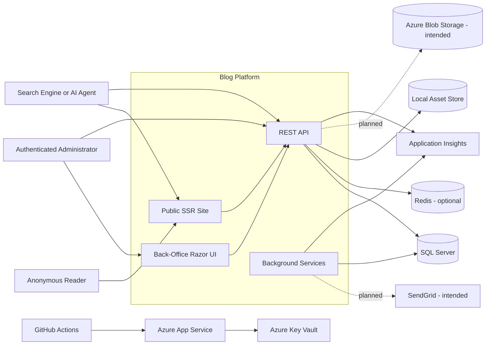
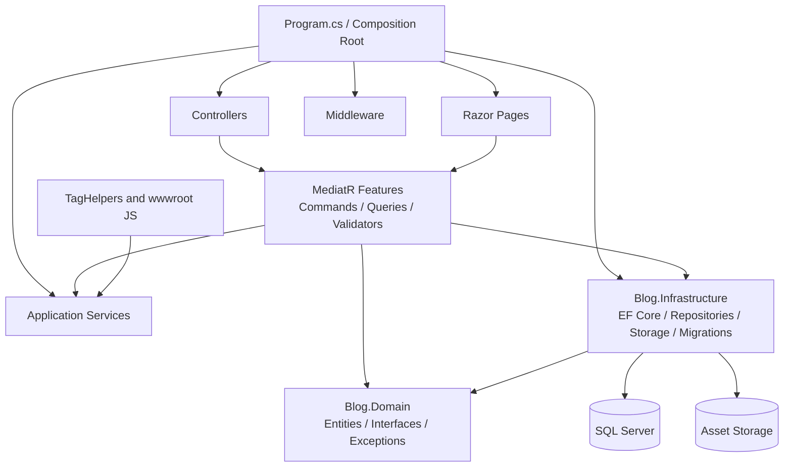
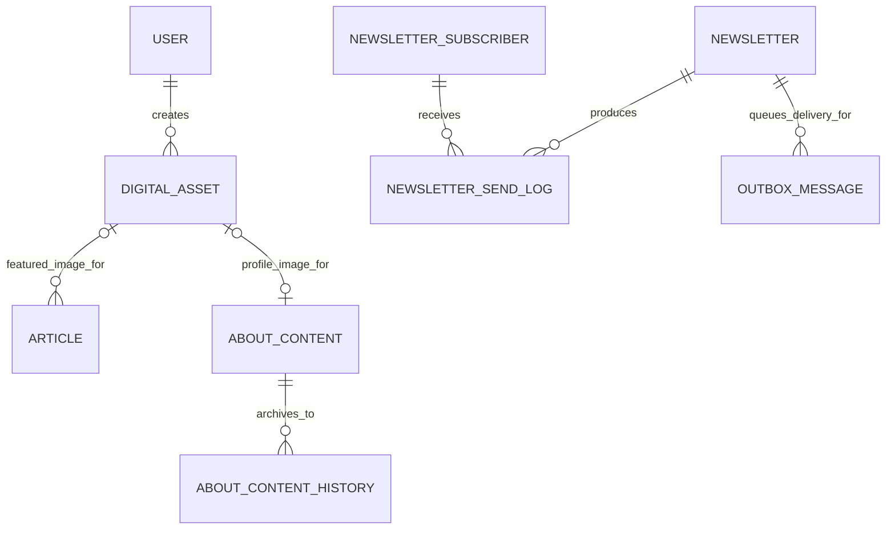
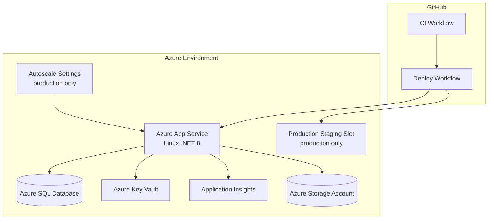

# ISO/IEC/IEEE 42010 Architecture Description

## 1. Identification

**System of interest:** `QuinntyneBrown/Blog`  
**Repository:** `https://github.com/QuinntyneBrown/Blog`  
**Architecture description type:** Source-based architecture description aligned to ISO/IEC/IEEE 42010 concepts  
**Inspected branch:** `master`  
**Inspected commit:** `e2086f8415cdce3bec5b58e98042bb3aa1ce4226`  
**Snapshot date:** `2026-04-06`  
**Primary evidence:** source code, infrastructure as code, GitHub workflows, detailed designs, ADRs, and requirements in the repository snapshot above

This document describes the implemented and intended architecture of the Blog platform as observed in the repository. Where repository artifacts disagree, executable code, infrastructure templates, and active CI/CD definitions are treated as the authoritative source of truth.

## 2. Purpose and Scope

The purpose of this architecture description is to make the Blog system understandable to developers, operators, maintainers, and decision-makers by documenting:

- the system boundary and external dependencies
- the internal structure and main responsibilities
- the information model and major runtime flows
- the deployment topology and operational model
- the architectural rationale, constraints, inconsistencies, and risks

The scope includes:

- the deployable ASP.NET Core application in `src/Blog.Api`
- the domain model in `src/Blog.Domain`
- the persistence and integration layer in `src/Blog.Infrastructure`
- the GitHub Actions delivery pipeline
- the Azure infrastructure templates in `infra`
- the automated test strategy under `test`

The scope excludes:

- third-party service implementations not yet integrated beyond placeholders
- downstream consumers outside the repository

## 3. System Mission

The Blog platform is a production-oriented content system centered on a server-rendered public site and a protected back office. Its stated mission is not broad CMS capability; it is a narrowly scoped publishing platform optimized for:

- article publishing and discoverability
- strong SEO and AI-agent discoverability
- high web performance with minimal client-side JavaScript
- secure back-office administration
- operational simplicity on a small Azure footprint

The current repository extends beyond articles and also contains newsletters, events, search, and about-page capabilities.

## 4. Stakeholders and Concerns

| Stakeholder | Primary Concerns |
|---|---|
| Anonymous reader | Fast page loads, readable pages, working search, reliable article/event/about content, accessible UI |
| Content author / administrator | Secure login, article CRUD, asset upload, publishing workflows, about-content editing, newsletter/event management |
| Maintainer / developer | Clear code organization, testability, local development, migration safety, predictable dependencies |
| Operator / platform owner | Health checks, deployment reliability, rollback, secrets management, logging, resource sizing, failure visibility |
| Security reviewer | Authentication strength, password handling, rate limiting, CORS, HTTPS, XSS prevention, least privilege |
| Search engines / crawlers / AI agents | Semantic HTML, structured data, canonical URLs, feeds, robots, `llms.txt`, stable content URLs |
| Product owner / architect | Traceability to requirements, architectural consistency, roadmap clarity, manageable evolution |
| External service providers | Well-defined integration boundaries for SQL Server, Redis, email delivery, storage, telemetry |

## 5. Architectural Context

### 5.1 Context Viewpoint

**Stakeholders:** reader, administrator, operator, search engines, AI agents, external service owners  
**Concerns addressed:** system boundary, external actors, external dependencies, trust boundaries  
**Model kinds:** context diagram, actor/dependency tables

### 5.2 Context View

### 5.3 Context Interpretation

The deployed system is a **single ASP.NET Core 8 host** that serves multiple responsibilities:

- server-rendered public pages
- server-rendered admin pages
- JSON REST endpoints
- image and SEO endpoints
- startup tasks
- background dispatch services

This is not a microservice architecture. It is a modular monolith with explicit internal boundaries and shared runtime.

## 6. Assumptions, Constraints, and Guiding Principles

| Category | Statement |
|---|---|
| Runtime model | One deployable web application hosts UI, API, and background processing |
| Platform | .NET 8 / ASP.NET Core 8 is the application framework |
| Rendering strategy | Public site is server-rendered Razor Pages with progressive enhancement |
| Persistence | SQL Server is the implemented primary database |
| Authentication | JWT is used for administrative API access; admin pages also use session-stored JWTs |
| Performance | Minimal JavaScript, compression, caching, and image optimization are core design constraints |
| Security | OWASP-oriented hardening is a first-class cross-cutting concern |
| Evolution | Some architecture elements are intentionally prepared before the external infrastructure is fully implemented |

## 7. Viewpoint Catalog

| Viewpoint | Stakeholders | Main Concerns | Model Kinds |
|---|---|---|---|
| Context | All | Boundary, actors, external systems | Context diagram, dependency table |
| Module and responsibility | Developers, architects | Internal decomposition, layering, responsibilities | Container/component diagram, responsibility matrix |
| Information | Developers, DB maintainers | Entities, relationships, concurrency, persistence | Entity tables, relationship model |
| Runtime | Developers, operators | Request flow, middleware, background processing, startup ordering | Pipeline tables, flow diagrams |
| Deployment and operations | Operators, architects | Environments, Azure resources, CI/CD, runtime topology | Deployment diagram, environment tables |
| Quality attributes | Security reviewers, operators, product owners | Security, performance, observability, testability | Scenario tables, mechanism catalog |
| Decision and risk | Architects, product owners | Rationale, debt, inconsistencies, roadmap | Decision summary, risk register |

## 8. Module and Responsibility View

### 8.1 Module and Responsibility Viewpoint

**Stakeholders:** developers, maintainers, architects  
**Concerns addressed:** code organization, responsibilities, compile-time dependencies, separation of concerns  
**Model kinds:** responsibility table, static dependency diagram

### 8.2 Static Structure View

### 8.3 Primary Modules

| Module | Main Responsibilities | Key Technologies | Depends On |
|---|---|---|---|
| `Blog.Api` host | Composition root, HTTP endpoints, middleware pipeline, background services, health checks | ASP.NET Core 8, Razor Pages, Controllers, MediatR, FluentValidation, Serilog | `Blog.Domain`, `Blog.Infrastructure` |
| `Blog.Api.Controllers` | REST and raw-response endpoints for auth, articles, assets, SEO, newsletters, subscriptions, events, about | MVC Controllers | Features, services |
| `Blog.Api.Pages` | Public and admin SSR UI | Razor Pages | Features, session auth |
| `Blog.Api.Features` | Vertical-slice command/query handlers with validators and DTOs | MediatR, FluentValidation | Repositories, domain, services |
| `Blog.Api.Services` | Auth, tokens, slugging, Markdown conversion, reading time, image variants, rate limiting, email, outbox processing | Custom services, background hosted services | Domain interfaces, configuration |
| `Blog.Api.Middleware` | Exception handling, correlation IDs, request logging, security headers, slug redirects, token extraction, rate limiting helpers | ASP.NET Core middleware | services, configuration |
| `Blog.Domain` | Entities, interfaces, enums, business exceptions | Plain C# model | none |
| `Blog.Infrastructure.Data` | EF Core context, entity configuration, repositories, migrations, seed data, unit of work | EF Core SQL Server | `Blog.Domain` |
| `Blog.Infrastructure.Storage` | Asset storage abstraction | local filesystem, placeholder blob storage | configuration |

### 8.4 Feature Slices Present in the Repository

| Slice | Public Surface | Administrative Surface | Persistence |
|---|---|---|---|
| Authentication | none | login/logout, protected APIs/pages | `Users` |
| Articles | listing, detail, search, feeds, sitemap, metadata | CRUD and publish/unpublish | `Articles`, `DigitalAssets` |
| Digital assets | optimized image serving | upload and delete | `DigitalAssets` |
| Search | autocomplete and results | none | SQL full-text search over `Articles` |
| SEO/discoverability | `robots.txt`, `llms.txt`, RSS, Atom, JSON Feed, sitemap | none | article and newsletter data |
| About page | public `/about` page | authoring and history restore | `AboutContents`, `AboutContentHistories` |
| Events | public events endpoints and page | event CRUD and publish/unpublish endpoints | `Events` |
| Newsletter | subscription and public archive endpoints | newsletter CRUD, send, subscriber list, outbox replay | `Newsletters`, `NewsletterSubscribers`, `NewsletterSendLogs`, `OutboxMessages` |

### 8.5 Architectural Style

The internal structure is best described as a **modular monolith using vertical slices**:

- the deployable unit is singular
- features are grouped by use case rather than by technical layer alone
- domain interfaces isolate application logic from storage mechanics
- infrastructure is injected through the composition root
- cross-cutting behaviors such as validation and logging run through MediatR and middleware

## 9. Information View

### 9.1 Information Viewpoint

**Stakeholders:** developers, DB maintainers, architects  
**Concerns addressed:** persistent state, relationships, identity, concurrency, lifecycle boundaries  
**Model kinds:** entity catalog, relationship model, lifecycle notes

### 9.2 Core Information Model

### 9.3 Entity Catalog

| Entity | Purpose | Notable Constraints |
|---|---|---|
| `User` | Back-office identity | unique email, password hash, display name |
| `Article` | Primary published content item | unique slug, optional featured image, `Version` concurrency token, published flag, publication timestamp |
| `DigitalAsset` | Uploaded asset metadata | unique stored filename, creator reference, file metadata |
| `Event` | Speaking/public event | unique slug, published flag, `Version` concurrency token, UTC-normalized start date |
| `Newsletter` | Newsletter authoring and archive item | status-driven lifecycle, optional unique slug, `Version` concurrency token |
| `NewsletterSubscriber` | Subscriber state | unique email, confirmation token hash, active/confirmed flags |
| `NewsletterSendLog` | Idempotent newsletter delivery record | unique composite key on newsletter + recipient idempotency key |
| `OutboxMessage` | Reliable deferred work item | message type, payload, retry count, status, next retry time |
| `AboutContent` | Current public about-page content | singleton-style record, profile image reference, `Version` concurrency token |
| `AboutContentHistory` | Immutable history of about-page revisions | archive keyed by about-content ID and archive time |

### 9.4 Information Management Rules

| Rule | Mechanism |
|---|---|
| Stable public URLs | slug fields with uniqueness constraints |
| Optimistic concurrency | `Version` columns on `Article`, `Event`, `Newsletter`, and `AboutContent` |
| Safe schema evolution | EF Core migrations applied on startup |
| Searchability | SQL Server full-text catalog and index over article title, abstract, and body |
| Delivery idempotency | `NewsletterSendLog` unique idempotency key |
| About-page auditability | history table for restored/previous content |

### 9.5 Observations

- The information model now supports more than articles alone.
- The architecture keeps the canonical content representations pre-rendered where useful, for example `Body` and `BodyHtml`.
- Search is optimized for SQL Server but includes a non-FTS fallback for environments without full-text support.

## 10. Runtime View

### 10.1 Runtime Viewpoint

**Stakeholders:** developers, operators, security reviewers  
**Concerns addressed:** request processing order, startup sequencing, background tasks, runtime collaboration  
**Model kinds:** middleware pipeline table, runtime flow summaries

### 10.2 HTTP Pipeline

| Order | Runtime Element | Purpose |
|---|---|---|
| 1 | `ExceptionHandlingMiddleware` | Converts failures to consistent error responses |
| 2 | `CorrelationIdMiddleware` | Adds correlation identity for diagnostics |
| 3 | `RequestLoggingMiddleware` | Emits structured request logs |
| 4 | `SecurityHeadersMiddleware` | Applies CSP and other security headers |
| 5 | `UseHttpsRedirection` in non-dev | Forces HTTPS |
| 6 | `UseResponseCompression` | Brotli/Gzip compression |
| 7 | `ResponseEnvelopeMiddleware` | Standardizes many API responses |
| 8 | `UseStatusCodePagesWithReExecute("/404")` | Friendly 404 handling |
| 9 | `UseSwagger` in development | API exploration |
| 10 | `SlugRedirectMiddleware` | Canonical lowercase path handling |
| 11 | `ContentHashRewriteMiddleware` | Static-asset content hash support |
| 12 | `UseStaticFiles` | Static asset serving with immutable caching |
| 13 | Routing / CORS / Session | Endpoint routing, CORS, admin session support |
| 14 | `LoginRateLimitMiddleware` and `UseRateLimiter` | Request throttling |
| 15 | `JwtMiddleware` | Header or session token extraction and validation |
| 16 | Authorization | Protects secured endpoints |
| 17 | Controllers, Razor Pages, health checks | Endpoint execution |

`UseResponseCaching` is intentionally disabled because CSP nonces make the current implementation incompatible with ASP.NET response caching.

### 10.3 Startup and Background Runtime

| Flow | Description |
|---|---|
| Startup migration | `MigrationRunner` applies pending EF Core migrations before serving requests |
| Startup seed | `SeedDataHostedService` seeds required admin/reference data after migrations |
| Outbox dispatch | `OutboxDispatchService` polls pending outbox messages, dispatches work, retries with exponential backoff and dead-lettering |
| Newsletter consumer placeholder | `NewsletterEmailDispatchService` is present as a no-op placeholder for future queue-based email delivery |

### 10.4 Key Runtime Scenarios

| Scenario | Main Path |
|---|---|
| Public article request | Razor Page -> MediatR query -> article repository -> SQL Server -> rendered HTML with SEO metadata |
| Admin login | controller/page -> `AuthService` -> user repository -> password verification -> JWT issuance -> session storage for admin UI |
| Asset fetch | `/assets/{file}` -> content negotiation -> variant lookup -> storage abstraction -> immutable response with `Vary: Accept` |
| Search request | API or search page -> search handler -> SQL full-text search or LIKE fallback -> highlighted DTOs |
| Newsletter send | authorized command -> create outbox work -> background dispatch -> email sender placeholder -> send log / retry / dead-letter |

### 10.5 Runtime Characteristics

- The system favors synchronous request-response processing for most user interactions.
- Reliability for newsletter delivery is being introduced through outbox semantics before queue infrastructure is complete.
- Public SSR pages and APIs share the same runtime, configuration, and persistence boundary.

## 11. Deployment and Operations View

### 11.1 Deployment and Operations Viewpoint

**Stakeholders:** operators, architects, developers  
**Concerns addressed:** runtime topology, environment strategy, secrets handling, delivery process, platform dependencies  
**Model kinds:** deployment diagram, environment table, CI/CD summary

### 11.2 Deployment View

### 11.3 Environment Model

| Environment | Delivery Mode | Intended Role | Notable Runtime Characteristics |
|---|---|---|---|
| Local development | local `dotnet run` | developer inner loop | LocalDB/SQL Server, development Swagger, local file assets |
| Staging | automatic after successful CI on `master` | validation before release | Azure App Service deployment and health check |
| Production | manual workflow dispatch | public release | Azure App Service, readiness health check, production-only slot and autoscale in Bicep |

### 11.4 Platform Services Declared in IaC

| Service | Role |
|---|---|
| Azure App Service | application host |
| Azure App Service Plan | compute plan, with premium/autoscale path in production template |
| Azure SQL | primary relational store |
| Azure Storage | intended object storage for assets |
| Azure Key Vault | secrets for JWT and SQL connection string |
| Application Insights | telemetry sink |
| Managed Identity | secure access to Key Vault and Storage |

### 11.5 CI/CD View

| Stage | Actions |
|---|---|
| CI | checkout -> setup .NET -> restore -> build -> `dotnet test` -> publish artifact |
| Staging deploy | download or build artifact -> Azure login -> web app deploy -> health check |
| Production deploy | manual trigger -> build and publish -> Azure login -> deploy -> readiness health check |

### 11.6 Operational Notes

- Health endpoints exist at `/health` and `/health/ready`.
- Logs are structured JSON and may go to console, rolling files, and Application Insights.
- Secrets are expected to come from configuration locally and Key Vault in Azure.
- Redis is optional and only activated when configured.

## 12. Quality Attribute View

### 12.1 Quality Attribute Viewpoint

**Stakeholders:** security reviewers, operators, readers, product owners  
**Concerns addressed:** quality goals and the mechanisms used to satisfy them  
**Model kinds:** mechanism catalog, scenario mapping

### 12.2 Security

| Concern | Implemented Mechanisms |
|---|---|
| Authentication | JWT bearer authentication; session-backed JWT for admin pages |
| Password protection | PBKDF2-SHA256 with salt, iterations, and encoded algorithm metadata |
| Request abuse | sliding-window rate limiting for login, write endpoints, subscriptions, and CSP reports; optional Redis backing |
| Transport security | HTTPS redirection outside development, minimum TLS in App Service template |
| Browser hardening | security headers middleware and CSP reporting endpoint |
| API boundary protection | FluentValidation, typed exceptions, authorization attributes, CORS allowlist |
| XSS mitigation | sanitization and encoded output strategy documented in detailed designs and reflected in content handling |
| Secret management | Key Vault references in App Service configuration |

### 12.3 Performance and Scalability

| Concern | Implemented Mechanisms |
|---|---|
| Fast first paint | server-side rendering with minimal JS |
| Network efficiency | Brotli and Gzip response compression |
| Static asset caching | immutable cache headers and content-hash rewrite strategy |
| HTML caching | cache profiles on public pages with short TTL |
| Image delivery | breakpoint-based AVIF/WebP generation with fallback |
| Search performance | SQL Server full-text search with fallback path |
| Scale-out path | production autoscale template exists in Bicep |

### 12.4 Observability and Operability

| Concern | Implemented Mechanisms |
|---|---|
| Service health | DB and disk-space health checks |
| Diagnostic traceability | correlation IDs and request logging |
| Log structure | Serilog compact JSON formatting |
| Failure visibility | startup migration logging, outbox retry/dead-letter logging, health probes |

### 12.5 Testability

| Test Layer | Evidence in Repository | Purpose |
|---|---|---|
| Domain unit tests | `test/Blog.Domain.Tests` | entity and rule verification |
| API/service tests | `test/Blog.Api.Tests` | handlers, middleware, services, tag helpers |
| Infrastructure tests | `test/Blog.Infrastructure.Tests` | repository and persistence behavior |
| Web/SEO tests | `test/Blog.Web.Tests` | page-generation utilities |
| Integration tests | `test/Blog.Integration.Tests` | end-to-end application behavior across security, SEO, performance, search, articles, observability |
| Browser E2E tests | `test/Blog.Playwright` | UI, accessibility, SEO, security, performance, and API browser-level validation |

## 13. Architecture Decisions and Rationale

| Decision | Rationale | Consequence |
|---|---|---|
| Use a single deployable ASP.NET Core host | Keep operational complexity low while serving public pages, admin pages, APIs, and background work together | Simpler deployment; tighter runtime coupling |
| Use vertical slices with MediatR | Organize by use case and keep request logic cohesive | Better feature locality; more MediatR plumbing |
| Prefer SSR Razor Pages | Optimize SEO, accessibility, and low-JS performance | Less SPA-style interactivity by default |
| Use EF Core with repositories and unit of work | Centralize persistence patterns and support testability | Extra abstraction over DbContext |
| Use SQL Server full-text search | Good fit for in-process operational simplicity without a separate search engine | Tighter coupling to SQL Server capabilities |
| Use JWT for admin APIs | Standard token-based auth with clear protected boundaries | Token/session handling complexity across API and Razor Pages |
| Use startup migrations and seeding | Reduce environment drift and manual setup | Startup depends on DB readiness and migration safety |
| Use outbox-style newsletter dispatch | Improve reliability and retry behavior before full queue infrastructure exists | Partial implementation until queue and email transport are real |
| Abstract asset storage behind `IAssetStorage` | Allow eventual move from local files to cloud storage | Current implementation gap between abstraction and cloud intent |

## 14. Correspondence and Consistency Rules

### 14.1 Correspondence Rules

| From | To | Rule |
|---|---|---|
| Controllers / Razor Pages | MediatR commands and queries | Each externally visible action should resolve to a feature slice or service operation |
| Feature handlers | Domain interfaces / services | Business use cases depend on abstractions rather than storage details |
| Domain entities | EF Core configuration and migrations | Every persisted entity should have explicit schema configuration |
| Background services | Outbox, newsletter, and email concerns | Deferred processing concerns should surface as hosted services plus persisted work state |
| Requirements | tests and detailed designs | Major quality and functional concerns should be reflected in automated tests and design docs |

### 14.2 Consistency Criteria Used for This Description

- Executable code overrides stale ADR or prose documentation.
- Infrastructure templates override older hosting prose when they conflict.
- A feature is considered implemented when there is concrete endpoint, handler, persistence, or page evidence.
- A feature is considered intended-but-incomplete when repository code contains placeholders, stubs, or comments deferring real integration.

## 15. Known Inconsistencies, Gaps, and Risks

| ID | Observation | Impact |
|---|---|---|
| R1 | The ADR index still lists PostgreSQL as the primary database, while the running code, EF provider, migrations, and search strategy are all SQL Server based. | Architecture documentation can mislead maintainers and reviewers. |
| R2 | Azure infrastructure config advertises blob-backed asset storage, but `Program.cs` always binds `IAssetStorage` to `LocalFileAssetStorage`, and `BlobAssetStorage` is a stub. | Production asset durability and multi-instance behavior are unclear or incorrect if deployed as-is. |
| R3 | Newsletter delivery references SendGrid and queue-oriented design, but `SendGridEmailSender` is only a logging stub and `NewsletterEmailDispatchService` is effectively a placeholder. | Newsletter capability is only partially implemented operationally. |
| R4 | `docs/hosting-strategy.md` describes a minimal B1/no-slot approach, while Bicep provisions a premium production plan with autoscale and a staging slot. | Operations documentation is inconsistent with actual infrastructure code. |
| R5 | High-level requirements still state that articles are the sole content type, but the repository now includes newsletters, events, and about content. | Scope statements in requirements are stale and weaken traceability. |
| R6 | Some features are marked draft in design docs while corresponding code paths and endpoints already exist. | Lifecycle state of features is ambiguous for planning and release readiness. |

## 16. Planned Evolution

Recommended evolution priorities implied by the current architecture:

1. Make storage strategy consistent end-to-end by implementing blob-backed `IAssetStorage` and selecting it through configuration.
2. Complete real email delivery and queue-backed newsletter dispatch, or explicitly downgrade the newsletter feature from implemented to planned.
3. Reconcile ADRs, L1/L2 requirements, README text, and hosting strategy with the architecture actually in source control.
4. Decide whether the modular monolith should remain singular or whether newsletters/events warrant separate runtime boundaries in the future.
5. Preserve the strong test posture while adding missing infrastructure integration tests for cloud storage and email dispatch.

## 17. Traceability Summary

| Concern Area | Requirements / Docs | Implemented Evidence |
|---|---|---|
| Articles and public display | `docs/specs/L1.md`, `docs/specs/L2.md`, detailed designs 02 and 03 | article controllers, pages, repositories, tests |
| SEO and discoverability | detailed design 05, backend ADRs 0007-0010 | `SeoController`, tag helpers, Playwright SEO tests |
| Performance | detailed design 07 | SSR pages, compression, caching, image variant generation, performance tests |
| Security | detailed design 08, security ADRs | JWT, password hasher, middleware, rate limiting, CORS, security tests |
| Observability | detailed design 09, infrastructure ADRs | Serilog, correlation middleware, health checks, CI health probes |
| Persistence | detailed design 10, data ADRs | EF Core context, migrations, repository/unit-of-work implementation |
| Search | detailed designs 11-13 | SQL FTS migration, search handler, `search.js`, search tests |
| Newsletter / events / about | L1/L2 draft sections and detailed designs 14-16 | controllers, handlers, entities, migrations, partial integrations |

## 18. Architecture Conclusions

The Blog platform is a well-structured modular monolith optimized for SEO-first publishing on ASP.NET Core. Its strongest architectural qualities are:

- clear modular decomposition inside a single deployable unit
- strong attention to security, performance, and discoverability
- unusually broad automated test coverage for a small content platform
- explicit groundwork for operational concerns such as health checks, logging, and deferred work

Its main weaknesses are not structural complexity but **architectural drift**:

- some written architecture artifacts no longer match the code
- some planned integrations are represented by stubs rather than complete runtime behavior
- infrastructure intent and application binding are not yet fully aligned

Overall, the architecture is coherent, implementation-driven, and viable as a modular monolith, but it needs documentation reconciliation and completion of the cloud storage and email/queue integration seams to be fully consistent end-to-end.

## 19. Evidence Base

This architecture description was derived primarily from:

- `src/Blog.Api/Program.cs`
- `src/Blog.Api/Controllers/*`
- `src/Blog.Api/Pages/*`
- `src/Blog.Api/Services/*`
- `src/Blog.Infrastructure/Data/*`
- `src/Blog.Infrastructure/Storage/*`
- `infra/*.bicep` and `infra/modules/*.bicep`
- `.github/workflows/*.yml`
- `docs/specs/L1.md` and `docs/specs/L2.md`
- `docs/detailed-designs/*`
- `docs/architecture-decision-records/*`

